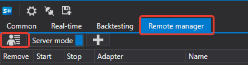
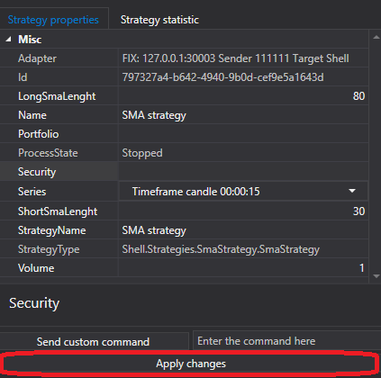

# RemoteManager

O separador **RemoteManager** permite ativar o modo de controlo remoto. Para ativar este modo, deve aceder ao menu de configuração do utilizador.



Na janela que aparece, defina o seu **nome de utilizador** e **palavra-passe**.


Depois, é necessário ativar o **modo de servidor**.


Agora pode ligar-se ao Shell a partir de outro Shell.

Para isso, precisa de executar **outro Shell**. Nele, aceda às definições de ligação.


Na janela que abre, configure a ligação FIX.


Depois prima o botão Ligar.


Quando estiver ligado, todas as estratégias existentes no servidor Shell ficarão disponíveis no cliente Shell.


Ao clicar no botão Adicionar, pode adicionar outra estratégia para negociar.


Como o cliente Shell suporta vários servidores, ao adicionar uma estratégia deve selecionar o servidor à esquerda. Todas as estratégias disponíveis no servidor aparecerão à direita.


Depois de adicionar uma estratégia, ela aparecerá na lista de estratégias.


Ao selecionar uma estratégia, haverá separadores à direita com as definições da estratégia, bem como as suas estatísticas.

Depois de alterar as definições da estratégia, certifique-se de clicar no botão Aplicar alterações; caso contrário, as alterações não serão aplicadas à estratégia.



Se a estratégia tiver um comando diferente de Start\/Stop, então, para o aplicar, deve defini-lo no campo seguinte.


E clicar no botão de envio do comando.

Para definir o seu comando na estratégia, precisa de substituir o método [Strategy.ApplyCommand](xref:StockSharp.Algo.Strategies.Strategy.ApplyCommand(StockSharp.Messages.CommandMessage))**(**[StockSharp.Messages.CommandMessage](xref:StockSharp.Messages.CommandMessage) cmdMsg **)**.

```cs
public virtual void ApplyCommand(CommandMessage cmdMsg)
		
```

A classe base [Strategy](xref:StockSharp.Algo.Strategies.Strategy) controla apenas o início e a paragem da estratégia.

## Conteúdo recomendado

[Definições de ligações](../connections_settings.md)
