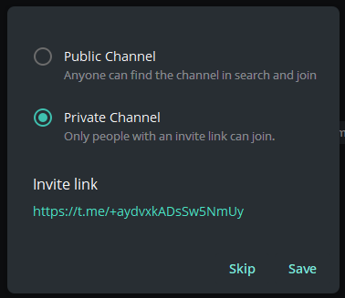

# Alertas

Um serviço para enviar mensagens de aplicações (como o [Designer](../designer.md) ou o seu próprio programa personalizado) para canais ou grupos privados e públicos no Telegram.

Para configurar:

1. Conclua o [processo de autorização do bot](authorization.md).

2. Crie um canal ou grupo (privado ou público).

   
   

3. Adicione o bot [StockSharpBot](https://t.me/StockSharpBot)

   

4. Torne-o administrador

   

5. Permissões necessárias para a operação correta

   

6. Escreva a palavra especial **activate** no canal ou grupo

   

7. Se for bem-sucedido, receberá uma resposta

   

O canal que criou está agora disponível para as suas estratégias e robôs de negociação:

  - Ao usar o [Designer](../designer.md), clique na lista de canais no painel superior:

  

  Na janela que aparece, verá listas de todos os canais e grupos onde ativou o bot:

  

  Premir o botão com o ícone do Telegram enviará uma mensagem de teste. Se for recebida, significa que tudo foi configurado corretamente.

  

  *No tarifário gratuito, é adicionada uma linha com menção ao site StockSharp. Nos tarifários pagos, esta linha é removida.*

Se tiver vários canais de saída no Telegram e quiser encaminhar diferentes estratégias para canais separados, pode especificar os canais de cada estratégia nas definições:

- Noutros programas, as definições são feitas de forma semelhante ao [Designer](../designer.md). Por exemplo, no programa [Hydra](../hydra.md), pode configurar o registo de erros para a transferência de dados de mercado se o [Hydra](../hydra.md) estiver localizado num servidor e precisar de receber rapidamente informação sobre uma ligação que não está a funcionar.
- No caso do [Shell](../shell.md) ou do [S#](../api.md), pode ver o código que integra as suas estratégias com o serviço Telegram.
