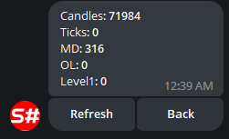

# Painel de Controlo

Um serviço para gerir estratégias e robôs de negociação através de um bot do Telegram.

Para configurar, conclua previamente o [processo de autorização do bot](authorization.md).

Depois disso, o bot está pronto para utilização. Em seguida, para que o bot comece a ver as suas estratégias, precisa de:

 - Ao usar o programa [Designer](../designer.md), ativar o modo remoto no painel Nuvem:

  

  Todas as estratégias executadas em modo Live serão automaticamente transferidas para o bot do Telegram, e poderá controlá-las a partir do seu telefone.

  No [StockSharpBot](https://t.me/StockSharpBot), selecione o comando /apps para ver uma lista de todos os programas:

  

  Depois de selecionar o programa pretendido, pode ver as estratégias e os respetivos controlos:

  

  

  

 - Ao usar o [Shell](../shell.md), aceda ao painel RemoteManager e configure as definições de forma semelhante ao [Designer](../designer.md).
 - Ao usar o [Hydra](../hydra.md), execute ações semelhantes às do [Designer](../designer.md). A integração com o [Hydra](../hydra.md) permite gerir a transferência de dados de mercado e monitorizar estatísticas quantitativas.

  
  

 - Ao usar o [S#](../api.md), pode integrar usando o código do [Shell](../shell.md). Graças ao facto de o [S#](../api.md) ser multiplataforma, os seus robôs podem ser executados em qualquer sistema operativo.
