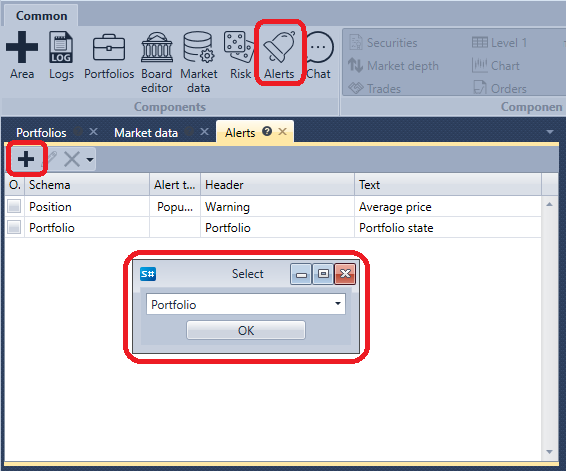

# Painel de notificações

O painel **Notificações** é uma tabela que apresenta informações sobre todas as notificações atualmente definidas.

No painel **Notificações**, pode editar  uma notificação existente, eliminá-la  ou definir uma nova notificação . 
