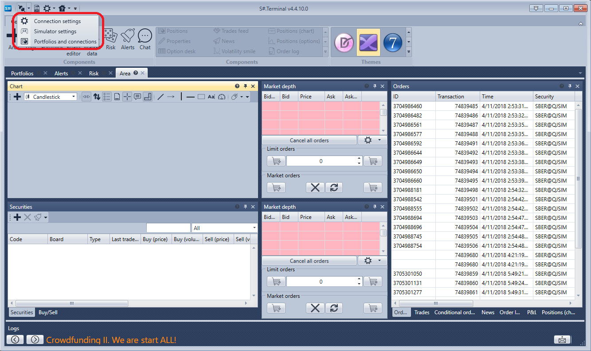
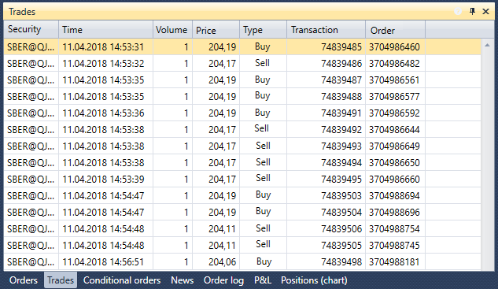

# Início rápido

Quando inicia o [Terminal](../terminal.md) pela primeira vez, será apresentada a seguinte janela:

Tem de selecionar o modo de arranque e clicar em **OK**.

Depois de selecionar o modo de arranque, a janela do terminal abre com o conjunto predefinido de componentes.

Vamos às definições de ligação e selecionamos a ligação necessária. A forma de configurar a ligação é descrita na secção [Definições de ligação](connection_settings.md).

O passo seguinte é estabelecer ligação clicando no botão **Ligar** .

Ao clicar no botão **Adicionar**  no painel do gráfico, adicionamos uma nova área de gráfico. Ao clicar com o botão direito do rato na área do gráfico, adicionamos velas para o instrumento que nos interessa. Podemos adicionar indicadores, negócios próprios e ordens ao gráfico. Também existe a possibilidade de registar ordens a partir do gráfico. Para obter mais informações sobre como trabalhar com o gráfico, consulte a secção [Gráfico](user_interface/components/chart.md).

Ao clicar no botão **Adicionar**  no painel Instrumentos, adiciona os instrumentos que pretende acompanhar. Os dados do melhor preço serão apresentados aqui. Para obter mais informações sobre como trabalhar com o painel Instrumentos, consulte a secção [Instrumentos](user_interface/components/instruments.md).

No livro de ofertas, depois de clicar no botão **Definições** , aparece um painel onde pode especificar o **Instrumento** e a **Carteira** para os negócios. Aqui também pode ajustar a profundidade do livro de ofertas. Para obter mais informações sobre como trabalhar com um livro de ofertas, consulte a secção [Livro de ofertas](user_interface/components/order_book.md).

Vamos registar as primeiras ordens. As ordens podem ser registadas clicando nos botões **Comprar/Vender** ou clicando nas células das colunas **Compra/Venda** do próprio livro de ofertas. O painel de ordens apresenta todas as suas ordens. Ao clicar com o botão direito do rato numa ordem, verá um painel que permite submeter uma nova ordem, cancelar ou alterar a ordem selecionada. Para obter mais informações sobre como trabalhar com o painel de ordens, consulte a secção [Ordens](user_interface/components/orders.md).

No painel Negócios, pode ver negócios por instrumentos. Para obter mais informações sobre como trabalhar com o painel Negócios, consulte a secção [Negócios](user_interface/components/trades.md).

Se necessário, pode adicionar componentes adicionais. Todos os componentes são descritos na secção [Componentes](user_interface/components.md).

