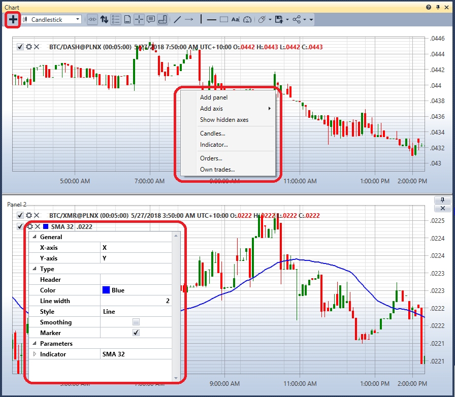
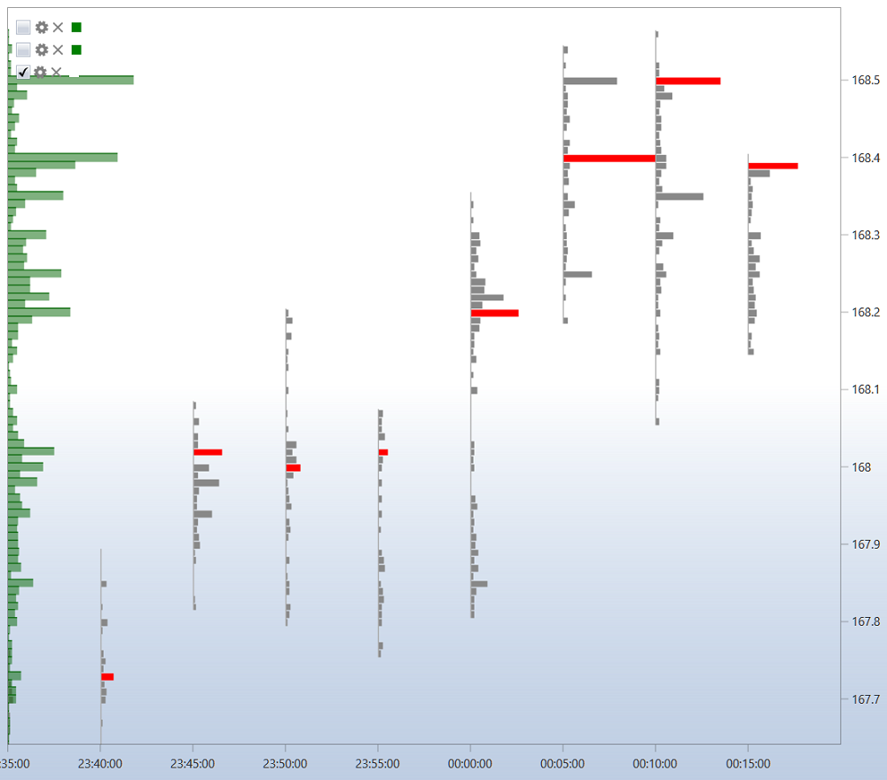

# Gráfico

O componente **Gráfico** permite desenhar velas e indicadores para o instrumento selecionado.

Para adicionar uma nova área, clique no botão . 

Para adicionar um novo elemento ao gráfico, clique com o botão direito do rato em qualquer ponto da área do gráfico e selecione o elemento necessário; as opções disponíveis incluem velas, indicadores, ordens e negócios próprios.

O canto superior esquerdo de cada gráfico mostra todos os elementos gráficos adicionados ao gráfico. Se desmarcar a caixa de seleção  de um elemento gráfico, esse elemento também é removido do gráfico.

Ao clicar em , são abertas as definições do elemento gráfico.

Pode registar ordens a partir do gráfico. Para isso, especifique primeiro o **Instrumento** e a **Carteira** para os quais as ordens serão registadas.

As ordens de compra serão registadas pela combinação de teclas **Ctrl+botão esquerdo do rato**.

As ordens de venda serão registadas pela combinação de teclas **Ctrl+botão direito do rato**.

Nas definições do elemento gráfico, pode definir o estilo de gráfico necessário: velas japonesas, barras, gráfico box, perfil de clusters, etc.

Para um gráfico box, as velas também podem ser agrupadas; a ordem de agrupamento é definida nos campos: multiplicador do 2.º período e multiplicador do 3.º período.

Existe uma barra de ferramentas acima do gráfico, onde pode selecionar deslocamento automático, zoom automático, modos de legenda e outras definições gerais do gráfico. Também pode selecionar os elementos a desenhar no gráfico: linhas, níveis, ponteiros, retângulo, texto.

## Consulte também

[Ordens](../../../designer/user_interface/components/orders.md)
