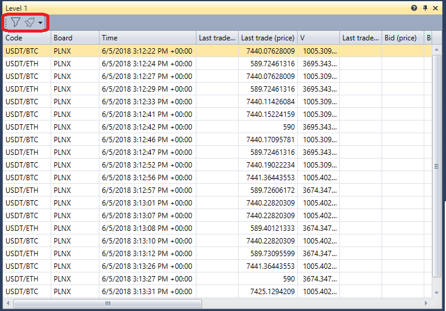

# Level 1

O componente **Level 1** é uma tabela com o histórico de alterações de **Level 1** para os instrumentos selecionados.

O **Level 1** tem um filtro para selecionar os instrumentos necessários. Também é possível configurar notificações para eventos dos instrumentos selecionados - [Definições de notificação](../../notifications.md).

## Conteúdo recomendado

[Compra/Venda](buy_sell.md)

