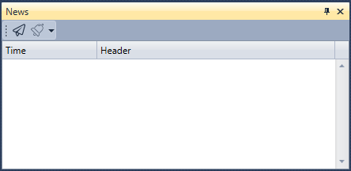

# Notícias

O componente **News** apresenta notícias recebidas das ligações.

Para começar a receber notícias, clique no botão **Receive news**.

O painel News permite configurar notificações para eventos selecionados – consulte [Definições de notificação](../../notifications.md).

## Conteúdo recomendado

[Posições (opções)](positions_options.md)

