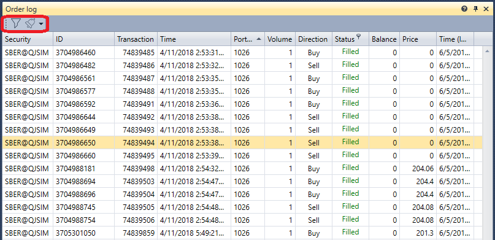

# Log de ordens

O componente **Order log** é uma tabela com ordens que apresenta informações completas sobre todas as ordens dos instrumentos selecionados.

O **Order log** tem um filtro para selecionar os instrumentos necessários. Também é possível configurar notificações para eventos dos instrumentos selecionados - [Definições de notificação](../../notifications.md).

## Conteúdo recomendado

[Armazenamento de dados de mercado](../../market_data_storage.md)

