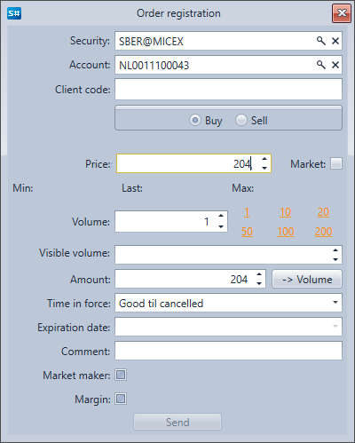

# Ordens

O componente **Ordens** é uma tabela com ordens, que apresenta informações completas sobre todas as ordens. Ao clicar com o botão direito do rato na ordem, aparece um painel com o qual pode registar uma nova ordem, cancelar ou alterar a ordem selecionada. 

Ao clicar no botão **Registo de ordem**, aparece uma janela. Para registar uma nova ordem, preencha-a e clique em **Enviar**.

Ao clicar no botão **Alterar ordem**, aparece uma janela. Para alterar a ordem, faça as alterações necessárias e clique em **Enviar**.

## Conteúdo recomendado

[Negócios](../../../designer/user_interface/components/trades.md)
