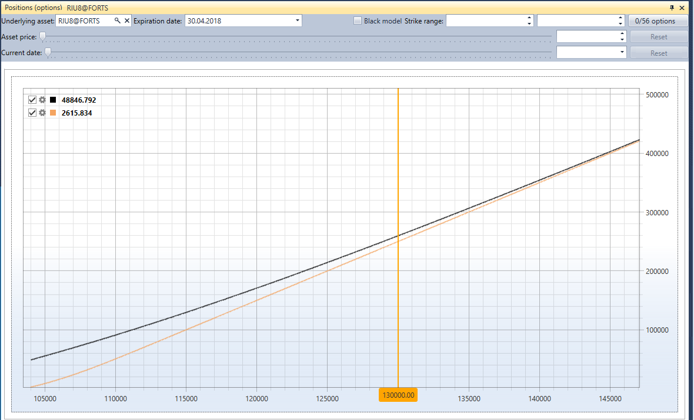

# Posições (opções)

**Posições (opções)** é uma apresentação gráfica da posição por opções.

Para apresentar a posição por opções, tem de selecionar o ativo subjacente e as opções com base nos preços das quais a posição será construída.

Além disso, pode especificar um filtro para a data de expiração exata das opções e filtros para strikes mínimos\/máximos.

## Conteúdo recomendado

[Painel de opções](option_desk.md)

