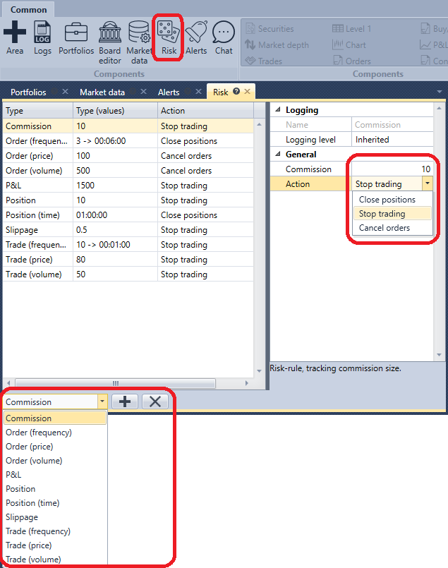

# Gestão de risco

No painel **Risco**, pode definir as definições de controlo de risco.

Na parte inferior do painel, tem de selecionar a **Regra de risco**, configurar a condição de acionamento da **Regra de risco** e a ação (Fechar posições, Parar negociação, Cancelar ordens), que será executada quando a condição da **Regra de risco** for acionada.

A lista de regras de risco e a respetiva descrição está disponível na secção [Gestão de risco](../../designer/user_interface/risk_management.md).
