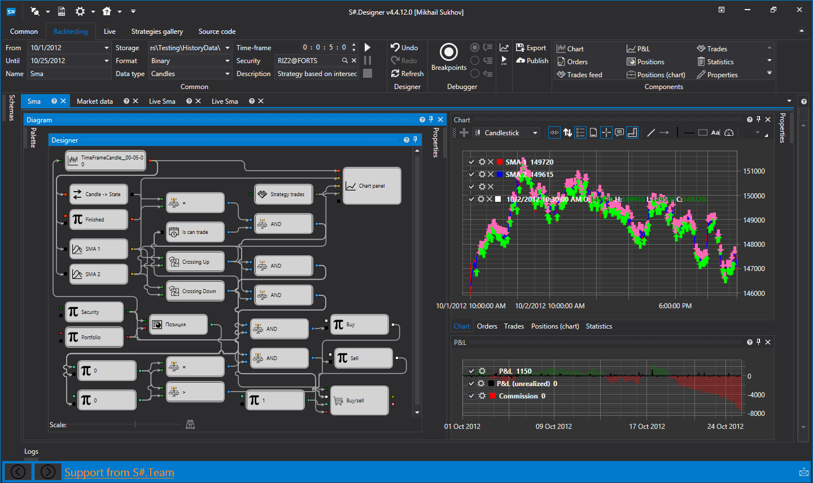
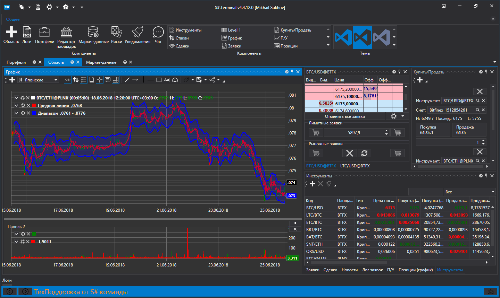
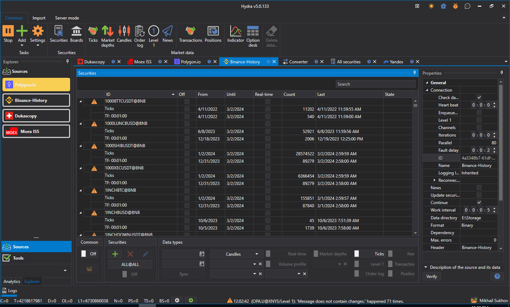

# О StockSharp

[StockSharp (кратко S\#)](https://stocksharp.ru/store/) \- **бесплатные** программы для торговли на всех площадках мира (российские, американские, азиатские, акции, фьючерсы, опционы, биткоины, форекс и т.д.). Вы сможете торговать в ручном режиме или с помощью торговых роботов (обычные или HFT). 

**Доступно более 90 подключений** различных бирж мира [Коннекторы](topics/api/connectors.md).

Вы можете работать с [S\#](topics/api.md) у любого брокера, который поддерживает наши подключения.

> [!NOTE] 
> Установка **всех** программ производится единообразно - через утилиту [Installer](topics/installer.md).

### Designer

Designer

[Designer](topics/designer.md) \- универсальная программа для создания торговых роботов и стратегий: 

- Графический визуальный дизайнер (создание стратегий мышкой).
- Написание стратегий на [C\#](https://ru.wikipedia.org/wiki/C_Sharp).
- Простое создание собственных индикаторов.
- Подключения к множеству терминалов и брокерам.
- Все мировые площадки.

[Подробнее...](topics/designer.md)

### Terminal

Terminal

[Terminal](topics/terminal.md) \- бесплатный торговый терминал. Основное преимущество, которого является одновременное подключение ко множеству торговых площадок, включая те, где нет собственного терминала. 

Преимущества и возможности Terminal:

1. **Поддержка боле 70 подключений** различных бирж мира [Коннекторы](topics/api/connectors.md).
2. **Торговля с графика**
3. **Произвольные тайм\-фреймы**
4. **Поддержка Volume, Tick, Range, PnF, Renko свечей**
5. **Кластеры и box графики**
6. **Любые рынки:** акции, фьючерсы, Forex, биткоины. 

[Подробнее...](topics/terminal.md)

### Hydra

Hydra

[Hydra](topics/hydra.md) \- программа для автоматического скачивания исторических и реал\-тайм маркет\-данных: 

- **Поддержка боле 70 подключений** различных бирж мира [Коннекторы](topics/api/connectors.md).
- **Высокая степенью сжатия** (2 байта на сделку, 7 байтов на стакан).
- **Любые типа данных** (свечи, тики, стаканы, ордер\-лог, опционы, новости и другое).
- **Программный доступ через API.**
- **Экспорт** в csv, excel, xml или базу данных.
- **Импорт** данных из csv.
- **Задачи по расписанию**.
- **Авто\-синхронизация** через Интернет между несколькими запущенными программами Hydra.

[Подробнее...](topics/hydra.md)

### API

API

[API](topics/api.md) \- библиотека для профессиональной разработки торговых роботов на языке C\#. Для тех, кто программирует в Visual Studio, и является профессиональным программистом в области алготрейдинга. 

### Все наши продукты:

Все наши продукты:

- [Designer](topics/designer.md) \- универсальная программа для создания торговых роботов и стратегий.
- [Hydra](topics/hydra.md) \- программа для скачивания маркет\-данных.
- [API](topics/api.md) \- библиотека для написания торговых роботов на языке [C\#](https://ru.wikipedia.org/wiki/C_Sharp) в Visual Studio.
- [Terminal](topics/terminal.md) \- торговый терминал.
- [Shell](topics/shell.md) \- готовый графический каркас c исходными кодами.
- [MatLab](topics/matLab.md) \- интеграция MatLab с торговыми системами. Торговля из скриптов MatLab.
- [ЛЧИ Viewer](https://stocksharp.ru/products/lci/) \- графики конкурса ЛЧИ со сделками участников.

***[Скачать](https://stocksharp.ru/products/download/)***

## См. также

[Справочные материалы](topics/common/reference_materials.md)
