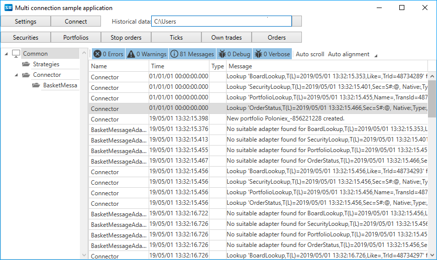
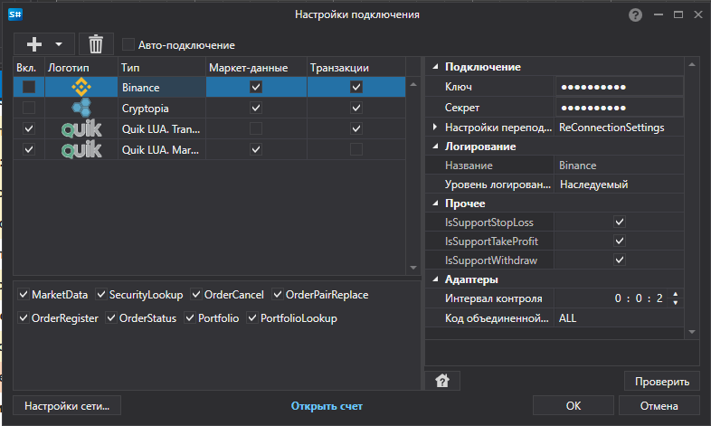

# Коннекторы

Для работы с биржами и источниками данных в [S\#](StockSharpAbout.md) рекомендуется работать через базовый класс [Connector](xref:StockSharp.Algo.Connector). 

Рассмотрим работу с [Connector](xref:StockSharp.Algo.Connector). Исходные коды примера находятся в проекте Samples\/Common\/SampleConnection.



Создаём экземпляр класса [Connector](xref:StockSharp.Algo.Connector):

```cs
...
public Connector Connector;
...
public MainWindow()
{
	InitializeComponent();
	Connector = new Connector();
	InitConnector();
}
		
```

Для конфигурирования [Connector](xref:StockSharp.Algo.Connector) у **API** есть специальный графический интерфейс, в котором можно настроить сразу несколько подключений одновременно. Как им воспользоваться описано в пункте [Графическое конфигурирование](API_ConnectorsUIConfiguration.md). 

```cs
...
private const string _connectorFile = "ConnectorFile.json";
...
private void Setting_Click(object sender, RoutedEventArgs e)
{
	if (Connector.Configure(this))
	{
		new JsonSerializer<SettingsStorage>().Serialize(Connector.Save(), _connectorFile);
	}
}
	  				
```



Аналогично можно добавлять подключения напрямую из кода (без графических окон), воспользовавшись методом расширением [TraderHelper.AddAdapter\<TAdapter\>](xref:StockSharp.Algo.TraderHelper.AddAdapter``1(StockSharp.Algo.Connector,System.Action{``0}))**(**[StockSharp.Algo.Connector](xref:StockSharp.Algo.Connector) connector, [System.Action\<TAdapter\>](xref:System.Action`1) init **)**:

```cs
...
// добавляем два подключения к QUIK (цены и заявки)
connector.AddAdapter<LuaFixMarketDataMessageAdapter>(a => { });
connector.AddAdapter<LuaFixTransactionMessageAdapter>(a => { });
	  				
```

В один объект [Connector](xref:StockSharp.Algo.Connector) можно добавлять неограниченное количество подключений. Поэтому одновременно из программы можно подключаться сразу к нескольким биржам и брокерам.

В методе *InitConnector* устанавливаем требуемые обработчики событий [IConnector](xref:StockSharp.BusinessEntities.IConnector):

```cs
private void InitConnector()
{
	// subscribe on connection successfully event
	Connector.Connected += () =>
	{
		this.GuiAsync(() => ChangeConnectStatus(true));
	};
	// subscribe on connection error event
	Connector.ConnectionError += error => this.GuiAsync(() =>
	{
		ChangeConnectStatus(false);
		MessageBox.Show(this, error.ToString(), LocalizedStrings.Str2959);
	});
	Connector.Disconnected += () => this.GuiAsync(() => ChangeConnectStatus(false));
	// subscribe on error event
	Connector.Error += error =>
		this.GuiAsync(() => MessageBox.Show(this, error.ToString(), LocalizedStrings.Str2955));
	// subscribe on error of market data subscription event
	Connector.MarketDataSubscriptionFailed += (security, msg, error) =>
		this.GuiAsync(() => MessageBox.Show(this, error.ToString(), LocalizedStrings.Str2956Params.Put(msg.DataType, security)))
	Connector.NewSecurity += _securitiesWindow.SecurityPicker.Securities.Add;
	Connector.NewTrade += _tradesWindow.TradeGrid.Trades.Add;
	Connector.NewOrder += _ordersWindow.OrderGrid.Orders.Add;
	Connector.NewStopOrder += _stopOrdersWindow.OrderGrid.Orders.Add;
	Connector.NewMyTrade += _myTradesWindow.TradeGrid.Trades.Add;
	
	Connector.NewPortfolio += _portfoliosWindow.PortfolioGrid.Portfolios.Add;
	Connector.NewPosition += _portfoliosWindow.PortfolioGrid.Positions.Add;
	// subscribe on error of order registration event
	Connector.OrderRegisterFailed += _ordersWindow.OrderGrid.AddRegistrationFail;
	// subscribe on error of order cancelling event
	Connector.OrderCancelFailed += OrderFailed;
	// subscribe on error of stop-order registration event
	Connector.OrderRegisterFailed += _stopOrdersWindow.OrderGrid.AddRegistrationFail;
	// subscribe on error of stop-order cancelling event
	Connector.StopOrderCancelFailed += OrderFailed;
	// set market data provider
	_securitiesWindow.SecurityPicker.MarketDataProvider = Connector;
	try
	{
		if (File.Exists(_settingsFile))
		{
			var ctx = new ContinueOnExceptionContext();
			ctx.Error += ex => ex.LogError();
			using (new Scope<ContinueOnExceptionContext> (ctx))
				Connector.Load(new JsonSerializer<SettingsStorage>().Deserialize(_settingsFile));
		}
	}
	catch
	{
	}
	ConfigManager.RegisterService<IExchangeInfoProvider>(new InMemoryExchangeInfoProvider());
	
	// нужен для графического конфигурирования
	ConfigManager.RegisterService<IMessageAdapterProvider>(new FullInMemoryMessageAdapterProvider(Connector.Adapter.InnerAdapters));
}
```

Как сохранять и загружать настройки [Connector](xref:StockSharp.Algo.Connector) в файл можно ознакомиться в пункте [Сохранение и загрузка настроек](API_Connectors_SaveConnectorSettings.md).

О создании собственного [Connector](xref:StockSharp.Algo.Connector) можно ознакомиться в пункте [Создание собственного коннектора](ConnectorCreating.md).

Выставление заявок описаны в пунктах [Заявки](Orders.md), [Создать новую заявку](CreateNewOrder.md), [Создать новую стоп заявку](API_StopOrders.md). 

## См. также

[Графическое конфигурирование](API_ConnectorsUIConfiguration.md)
