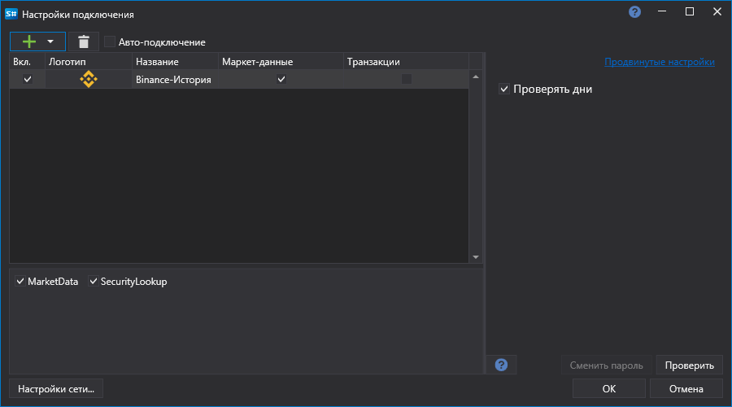

# Графическое конфигурирование Binance History

Для всех продуктов [S\#](StockSharpAbout.md) графическая настройка подключения выполняется в экранной форме [Окно настройки подключений](API_UI_ConnectorWindow.md):

- **Проверять дни** \- Проверять запрашиваемый дни истории перед отправкой запроса на скачивание данных.