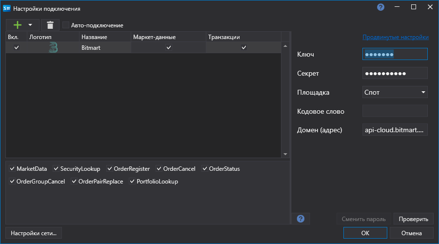

# Графическое конфигурирование Bitmart

Для всех продуктов [S\#](StockSharpAbout.md) графическая настройка подключения выполняется в экранной форме [Окно настройки подключений](API_UI_ConnectorWindow.md):

- **Ключ** \- Ключ. 
- **Секрет** \- Секрет. 
- **Кодовое слово** \- Специальное слово для совершения торговых операций. 
- **Площадка** \- Секция торгов (спот, фьючерсы). 

## См. также

[Коннекторы](API_Connectors.md)

[Графическое конфигурирование](API_ConnectorsUIConfiguration.md)

[Создание собственного коннектора](ConnectorCreating.md)

[Сохранение и загрузка настроек](API_Connectors_SaveConnectorSettings.md)
