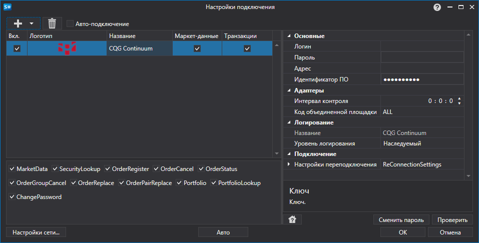

# Графическое конфигурирование CQG Continuum

Для всех продуктов [S\#](StockSharpAbout.md) графическая настройка подключения выполняется в экранной форме [Окно настройки подключений](API_UI_ConnectorWindow.md):

- **Логин** \- Логин.
- **Адрес** \- Пароль.
- **Пароль** \- Адрес сервера.
- **Идентификатор ПО** \- Уникальный идентификатор программного обеспечения.
- **Настройки переподключения** \- Настройки механизма отслеживания подключения с торговой системой ([Настройки переподключения](Reconnect.md)). 
- **Интервал контроля** \- Интервал оповещения сервера о том, что подключение еще живое. По умолчанию равно 1 минуте. 
- **Код объединенной площадки** \- Код площадки для объединенного инструмента. 

## См. также

[Коннекторы](API_Connectors.md)

[Графическое конфигурирование](API_ConnectorsUIConfiguration.md)

[Создание собственного коннектора](ConnectorCreating.md)

[Сохранение и загрузка настроек](API_Connectors_SaveConnectorSettings.md)
