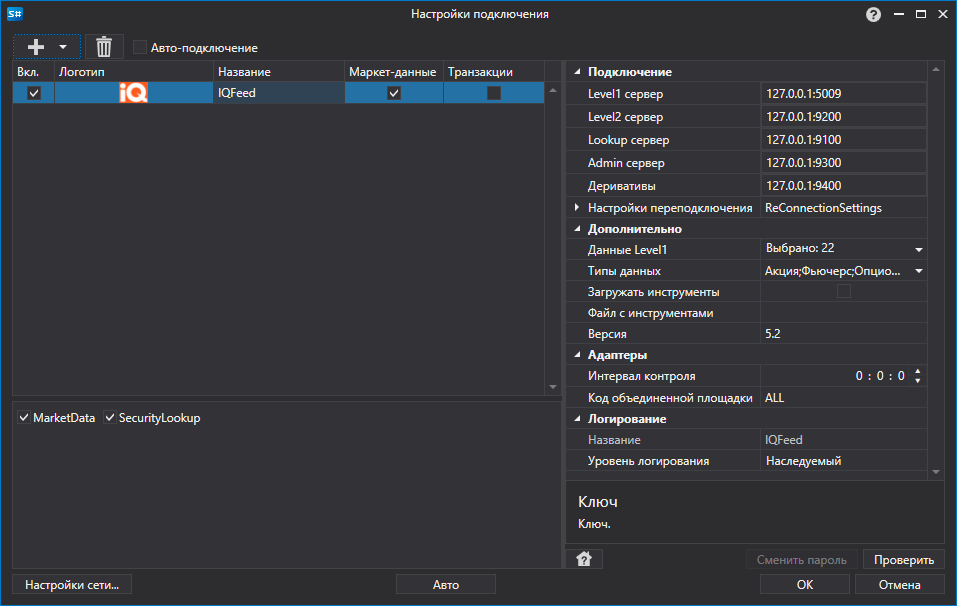

# Графическое конфигурирование IQFeed

Для всех продуктов [S\#](StockSharpAbout.md) графическая настройка подключения выполняется в экранной форме [Окно настройки подключений](API_UI_ConnectorWindow.md):

- **Levell сервер**

   \- Адрес для получения данных по Levell.
- **Level2 сервер**

   \- Адрес для получения данных по Level2.
- **Lookup сервер**

   \- Адрес для получения исторических данных.
- **Admin сервер**

   \- Адрес для получения служебных данных
- **Деривативы**

   \- Адрес для получения производных данных.
- **Данные Levell**

   \- Все типы данных для Levell, которые необходимо транслировать.
- **Типы данных**

   \- Типы инструментов, по которым необходимо получить данные.
- **Загружать инструменты**

   \- Загружать ли инструменты из архива с сайта IQFeed.
- **Файл с инструментами**

   \- Путь к файлу со списком инструментов IQFeed, скачанный с сайта. Если путь задан, то повторное скачивание с сайта не происходит, и парсится только локальная копия.
- **Версия**

   \- Версия.
- **Настройки переподключения**

   \- Настройки механизма отслеживания подключения с торговой системой (

  [Настройки переподключения](Reconnect.md)

  ). 
- **Интервал контроля**

   \- Интервал оповещения сервера о том, что подключение еще живое. По умолчанию равно 1 минуте. 
- **Код объединенной площадки**

   \- Код площадки для объединенного инструмента. 

## См. также

[Коннекторы](API_Connectors.md)

[Графическое конфигурирование](API_ConnectorsUIConfiguration.md)

[Создание собственного коннектора](ConnectorCreating.md)

[Сохранение и загрузка настроек](API_Connectors_SaveConnectorSettings.md)
