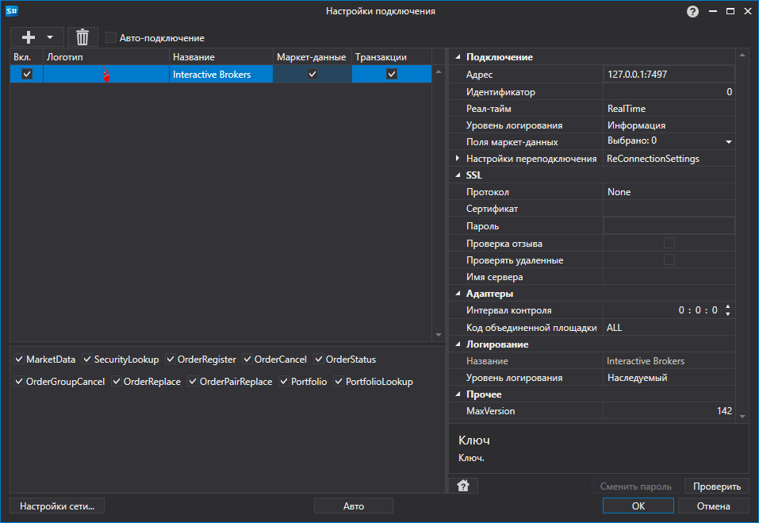

# Графическое конфигурирование Interactive Brokers

Для всех продуктов [S\#](StockSharpAbout.md) графическая настройка подключения выполняется в экранной форме [Окно настройки подключений](API_UI_ConnectorWindow.md):

- **Адрес** \- Адрес TWS.
- **Идентификатор** \- Уникальный идентификатор. Используется в случае подключения нескольких клиентов к одному терминалу или gateway.
- **Реал\-тайм** \- Использовать ли данные реального времени или 'замороженные' на сервере брокера.
- **Уровень логирования** \- Уровень логирования сообщений сервера.
- **Поля маркет\-данных** \- Поля маркет\-данных. которые будут получаться при подписке на Level1 сообщения.
- **Протокол** \- SSL протокол для установления соединения.
- **Сертификат** \- SSL сертификат.
- **Пароль** \- Пароль к SSL сертификату.
- **Проверка отзыва** \- Проверка отзыва сертификата.
- **Проверять удаленные** \- Проверять удаленные сертификаты.
- **Имя сервера** \- Имя сервера, использующего SSL\-соединение.
- **Настройки переподключения** \- Настройки механизма отслеживания подключения с торговой системой ([Настройки переподключения](Reconnect.md)). 
- **Интервал контроля** \- Интервал оповещения сервера о том, что подключение еще живое. По умолчанию равно 1 минуте. 
- **Код объединенной площадки** \- Код площадки для объединенного инструмента. 

## См. также

[Коннекторы](API_Connectors.md)

[Графическое конфигурирование](API_ConnectorsUIConfiguration.md)

[Создание собственного коннектора](ConnectorCreating.md)

[Сохранение и загрузка настроек](API_Connectors_SaveConnectorSettings.md)
