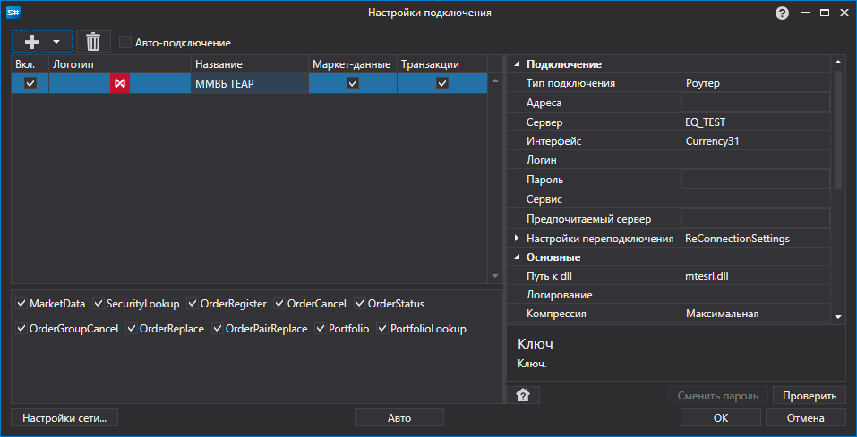

# Графическое конфигурирование Micex (TEAP)

Для всех продуктов [S\#](StockSharpAbout.md) графическая настройка подключения выполняется в экранной форме [Окно настройки подключений](API_UI_ConnectorWindow.md):

- **Тип подключения** \- Тип подключения.
- **Адреса** \- Список адресов и портов серверов доступа.
- **Сервер** \- Идентификатор сервера доступа, например «EQ\_TEST».
- **Интерфейс** \- Идентификатор интерфейса торговой системы ММВБ.
- **Логин** \- Логин.
- **Пароль** \- Пароль.
- **Сервис** \- Имя сервиса торговой системы.
- **Предпочитаемый сервер** \- Адрес предпочитаемого сервера доступа.
- **Путь к dll** \- Путь к файлу mtesrl.dll.
- **Логирование** \- Уровень логирования в формате N,M. Максимальный уровень логирования равен «5,2». Минимальный (выключен) «0,0».
- **Компрессия** \- Параметр компрессии данных. По умолчанию равен BZip.
- **Код клиента** \- Код клиента, присвоенный брокером.
- **Язык** \- Язык для сообщений об ошибках. Допустимые значения: «English», «Russian», «Ukrainian».
- **Комментарий** \- Поле, в которое нужно записывать пользовательский комментарий транзакции.
- **Глубина стакана** \- Глубина стакана.
- **Все стаканы** \- Запрашиваемые стаканы по всем инструментам.
- **Перезаписать** \- Перезаписать файл библиотеки из ресурсов. По умолчанию файл будет перезаписан.
- **Дополнительно** \- Дополнительно.
- **Cancel On Disconnect** \- Интервал оповещения сервера об активности. Используется в режиме Cancel On Disconnect.
- **Настройки переподключения** \- Настройки механизма отслеживания подключения с торговой системой ([Настройки переподключения](Reconnect.md)). 
- **Интервал контроля** \- Интервал оповещения сервера о том, что подключение еще живое. По умолчанию равно 1 минуте. 
- **Код объединенной площадки** \- Код площадки для объединенного инструмента. 

## См. также

[Коннекторы](API_Connectors.md)

[Графическое конфигурирование](API_ConnectorsUIConfiguration.md)

[Создание собственного коннектора](ConnectorCreating.md)

[Сохранение и загрузка настроек](API_Connectors_SaveConnectorSettings.md)
