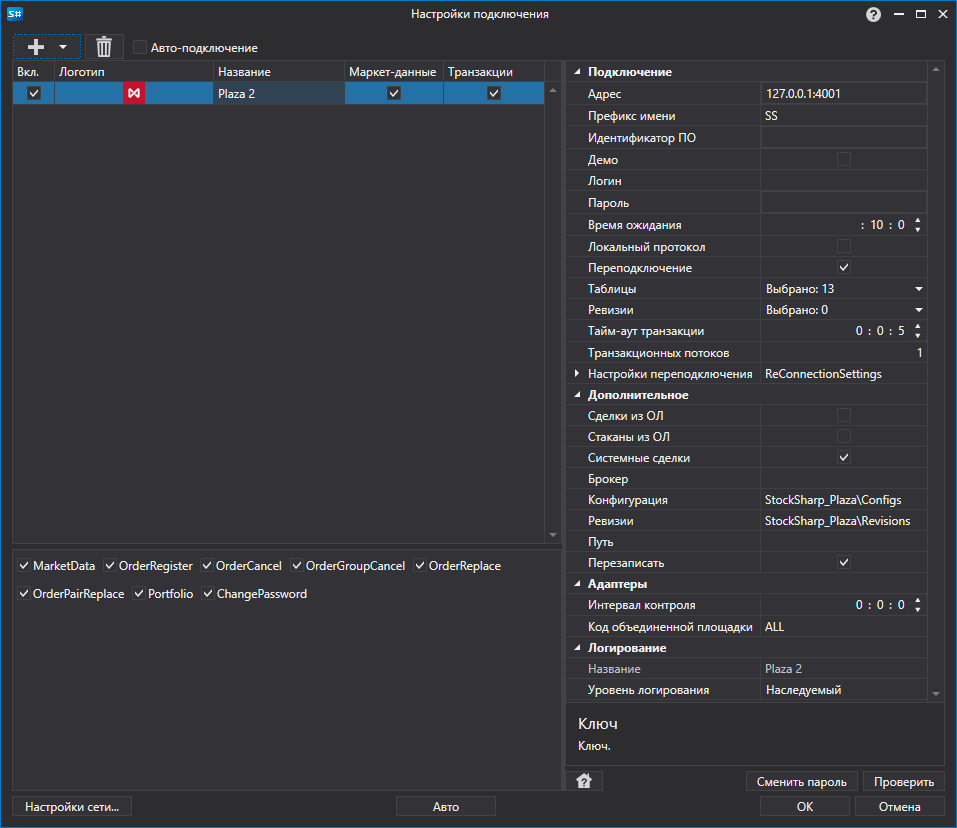

# Графическое конфигурирование Plaza II

Для всех продуктов [S\#](StockSharpAbout.md) графическая настройка подключения выполняется в экранной форме [Окно настройки подключений](API_UI_ConnectorWindow.md):

- **Адрес** \- Адрес.
- **Префикс имени** \- Префикс в имени приложения Plaza соединения.
- **Идентификатор ПО** \- Уникальный идентификатор программного обеспечения.
- **Демо** \- Подключаться ли к демо торгам вместо сервера с реальной торговлей.
- **Логин** \- Логин. Используется в случае авторизованного подключения к роутеру.
- **Пароль** \- Пароль. Используется в случае авторизованного подключения к роутеру.
- **Время ожидания** \- Время, в течение которого ожидается получение сообщения из потока данных или отправка транзакций.
- **Локальный протокол** \- Использовать SharedMem протокол при соединении с локальным роутером. По умолчанию не используется.
- **Переподключение** \- Контролировать потерю соединения с роутером.
- **Таблицы** \- Список таблиц для получения данных.
- **Ревизии** \- Таблицы, которые необходимо отслеживать на изменение
- **Тайм\-аут транзакции** \- Время, в течении которого ожидается ответ для транзакции. По умолчанию равно 5 секундам.
- **Транзакционных потоков** \- Число транзакционных потоков. Значение по умолчанию равно 1.
- **Сделки из ОЛ** \- Использовать лог заявок (orders log) для создания тиковых сделок. По умолчанию выключено.
- **Стаканы из ОЛ** \- Использовать лог заявок (orders log) для создания стаканов. По умолчанию выключено.
- **Системные сделки** \- Передавать только системные сделки. По умолчанию значение равно true.
- **Брокер** \- Код брокерской фирмы.
- **Конфигурация** \- Путь к директории, в которой будут храниться схемы потоков Plaza.
- **Ревизии** \- Путь к директории, куда будут сохраняться ревизии.
- **Путь** \- Путь к директории, куда будут сохраняться файлы Plaza SDK.
- **Перезаписать** \- Перезаписать файл библиотеки из ресурсов. По умолчанию файл будет перезаписан.
- **Настройки переподключения** \- Настройки механизма отслеживания подключения с торговой системой ([Настройки переподключения](Reconnect.md)). 
- **Интервал контроля** \- Интервал оповещения сервера о том, что подключение еще живое. По умолчанию равно 1 минуте. 
- **Код объединенной площадки** \- Код площадки для объединенного инструмента. 

## См. также

[Коннекторы](API_Connectors.md)

[Графическое конфигурирование](API_ConnectorsUIConfiguration.md)

[Создание собственного коннектора](ConnectorCreating.md)

[Сохранение и загрузка настроек](API_Connectors_SaveConnectorSettings.md)
