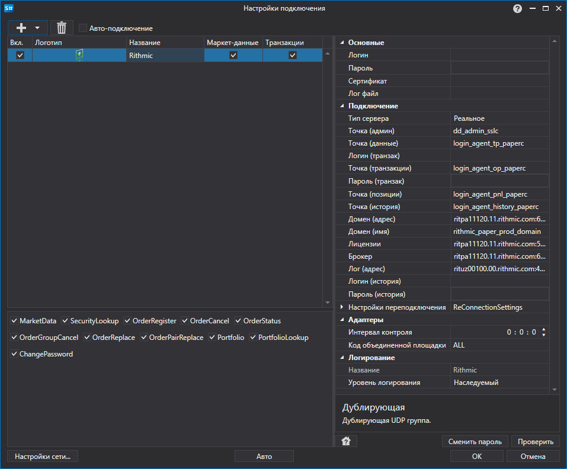

# Графическое конфигурирование Rithmic

Для всех продуктов [S\#](StockSharpAbout.md) графическая настройка подключения выполняется в экранной форме [Окно настройки подключений](API_UI_ConnectorWindow.md):

- **Логин**

   \- Логин.
- **Пароль**

   \- Пароль.
- **Сертификат**

   \- Путь к файлу сертификата, необходимому для подключения к системе Rithmic.
- **Лог файл**

   \- Путь к лог файлу.
- **Тип сервера**

   \- Тип сервера.
- **Точка (админ)**

   \- Точка подключения для административных функций (инициализация\/ деинициализация).
- **Точка (данные)**

   \- Точка подключения к рыночным данным.
- **Логин (транзак)**

   \- Дополнительное имя пользователя. Используется в случае, если отправка транзакций осуществляется на отдельный сервер.
- **Точка (транзакции)**

   \- Точка подключения к системе исполнения транзакций.
- **Пароль (транзак)**

   \- Дополнительный пароль. Используется в случае, если отправка транзакций осуществляется на отдельный сервер.
- **Точка (позиции)**

   \- Точка подключения для получения информации по портфелях и позициях.
- **Точка (история)**

   \- Точка подключения для получения исторических данных.
- **Домен (адрес)**

   \- Адрес домена.
- **Домен (имя)**

   \- Имя домена.
- **Лицензии**

   \- Адрес сервера лицензий.
- **Брокер**

   \- Адрес брокера.
- **Лог (адрес)**

   \- Адрес логгера.
- **Логин (история)**

   \- Дополнительный логин. Используется для авторизации на сервере истории.
- **Пароль (история)**

   \- Дополнительный пароль. Используется для авторизации на сервере истории.
- **Настройки переподключения**

   \- Настройки механизма отслеживания подключения с торговой системой (

  [Настройки переподключения](Reconnect.md)

  ). 
- **Интервал контроля**

   \- Интервал оповещения сервера о том, что подключение еще живое. По умолчанию равно 1 минуте. 
- **Код объединенной площадки**

   \- Код площадки для объединенного инструмента. 

## См. также

[Коннекторы](API_Connectors.md)

[Графическое конфигурирование](API_ConnectorsUIConfiguration.md)

[Создание собственного коннектора](ConnectorCreating.md)

[Сохранение и загрузка настроек](API_Connectors_SaveConnectorSettings.md)
