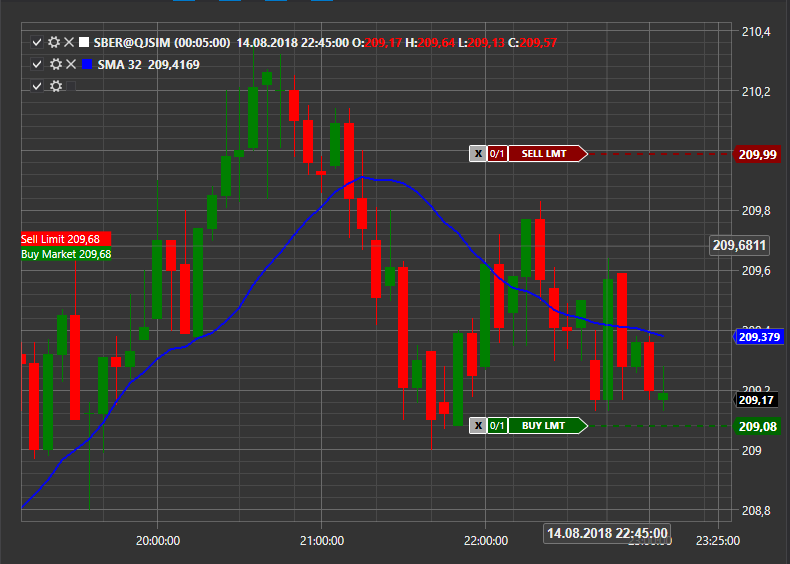

# Выставление заявок с графика

S\# позволяет выставлять заявки с графика, для активации этой возможности необходимо свойство [OrderCreationMode](../api/StockSharp.Xaml.Charting.Chart.OrderCreationMode.html) установить в True, по умолчанию оно отключено.



Заявки на покупку будут выставляться по сочетанию клавиш Ctrl + ЛКМ. 

Заявки на продажу будут выставляться по сочетанию клавиш Ctrl + ПКМ. 

Получившуюся заявку можно перехватить через событие создания новой заявки.

```cs
ChartPanel.CreateOrder += (chartArea,order) =>
{
	order.Portfolio = _portfolio;
	order.Security = _security;
	order.Volume = 1;
	
	_connector.RegisterOrder(order);
};
```

Выставленные заявки будут отображаться в виде специального элемента для отображения заявок [ChartActiveOrdersElement](../api/StockSharp.Xaml.Charting.ChartActiveOrdersElement.html).
