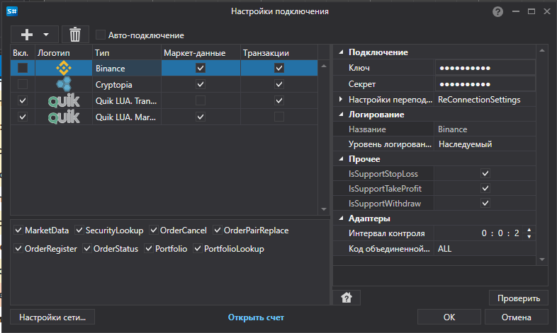

# Окно настройки подключений

[ConnectorWindow](xref:StockSharp.Xaml.ConnectorWindow) \- Специальное окно для настройки адаптеров подключения коннектора. 



Здесь представлено окно настройки подключений. Из раскрывающегося списка (открывается кнопкой '+') необходимо выбрать нужные адаптеры и настроить их свойства в окне свойств, расположенном справа. 

Вызов данного окна следует выполнять через метод расширение [Extensions.Configure](xref:StockSharp.Xaml.Extensions.Configure(StockSharp.Algo.Connector,System.Windows.Window))**(**[StockSharp.Algo.Connector](xref:StockSharp.Algo.Connector) connector, [System.Windows.Window](xref:System.Windows.Window) owner**)**, в который передается [Connector](xref:StockSharp.Algo.Connector) и родительское окно. При удачной настройке метод расширение [Extensions.Configure](xref:StockSharp.Xaml.Extensions.Configure(StockSharp.Algo.Connector,System.Windows.Window))**(**[StockSharp.Algo.Connector](xref:StockSharp.Algo.Connector) connector, [System.Windows.Window](xref:System.Windows.Window) owner**)** вернет значение "true". Ниже приведен код вызова окна настройки подключения коннектора и сохранения настроек в файл. 

```cs
		private void Setting_Click(object sender, RoutedEventArgs e)
		{
			if (_connector.Configure(this))
			{
				new XmlSerializer<SettingsStorage>().Serialize(_connector.Save(), _connectorFile);
			}
		}
	  				
```

> [!TIP]
> Корректность подключения можно проверить при помощи кнопки **Проверить**.

Результатом работы этого окна будет создание и добавление адаптеров в список *внутренних* адаптеров свойства [Connector.Adapter](xref:StockSharp.Algo.Connector.Adapter). 

Более подробно о сохранении и загрузки настроек коннектора описано в пункте [Сохранение и загрузка настроек](API_Connectors_SaveConnectorSettings.md).
