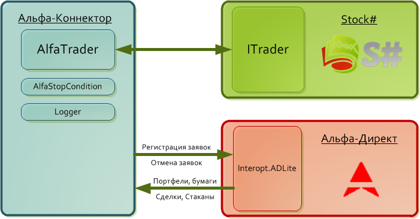
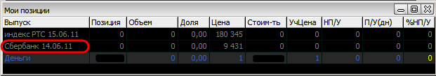
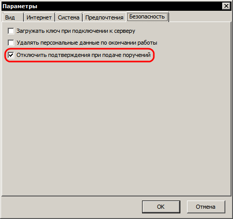
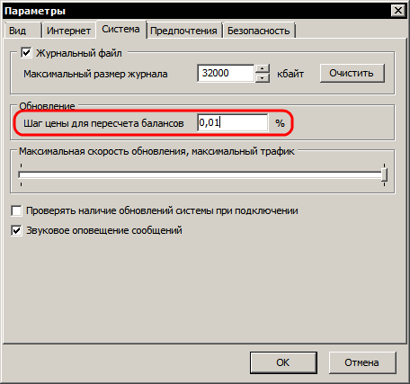
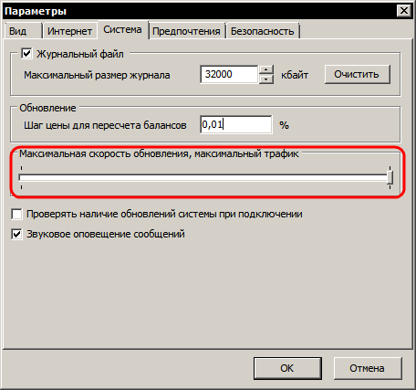

# Настройка терминала Альфа\-Директ

Механизм взаимодействия показан на данном рисунке: 

Как видно из рисунка, [AlfaDirectMessageAdapter](xref:StockSharp.AlfaDirect.AlfaDirectMessageAdapter) взаимодействует с брокером через терминал [Альфа\-Директ](https://www.alfadirect.ru/). Связь между [AlfaDirectMessageAdapter](xref:StockSharp.AlfaDirect.AlfaDirectMessageAdapter) и [Альфа\-Директ](https://www.alfadirect.ru/) осуществляется по технологии [COM](https://ru.wikipedia.org/wiki/Component_Object_Model) посредством открытого интерфейса терминала. [Открытый интерфейс терминала Альфа\-Директ](https://www.alfadirect.ru/mobile-app/terminal-alfa-direct) позволяет получать в режиме реального времени всю доступную в терминале табличную информацию и подавать торговые поручения. 

Для корректной работой с [AlfaDirectMessageAdapter](xref:StockSharp.AlfaDirect.AlfaDirectMessageAdapter) необходимо предварительно настроить торговый терминал [Альфа\-Директ](Alfa.md). 

### Настройка терминала Альфа\-Директ

Настройка терминала Альфа\-Директ

1. Для удобства, создайте новую вкладку (Правый клик мыши на вкладках снизу терминала \-\> Добавить). Добавьте окна "Сделки" и "Очередь заявок" для интересующего вас инструмента \- меню "Информация \-\> Сделки" и "Информация \-\> Очередь заявок" соответственно.
2. Добавьте окно "Позиции" на вкладку (меню "Портфели \-\> Позиции"). Убедитесь, что интересующий Вас инструмент присутствует в списке.

   Пример (для фьючерсного контракта SBER\-6.11): 

   

   > [!TIP]
   > Если у Вас не отображается инструмент в списке позиций, необходимо вручную выставить любую заявку по данному инструменту \- например, лимитная заявка на покупку по цене выше текущей и затем отменить его. 
3. Далее необходимо отключить подтверждения при подаче поручений \- меню "Сервис \-\> Параметры" \-\> вкладка "Безопасность" \-\> поставить галочку "Отключить подтверждения при подаче поручений".

   
4. Для более частого пересчета баланса портфелей измените следующие настройки \- меню "Сервис \-\> Параметры" \-\> вкладка "Система" \-\> выставить значение "Шаг цены для пересчета балансов" равным 0,01%. 

   
5. Для увеличения скорости передачи данных включите опцию "Максимальная скорость обновления, максимальный трафик" \- меню "Сервис \-\> Параметры" \-\> вкладка "Система. 

   

## См. также

[Пример использования](AlfaFirstStrategy.md)

[Отладка](LoggingITrader.md)
