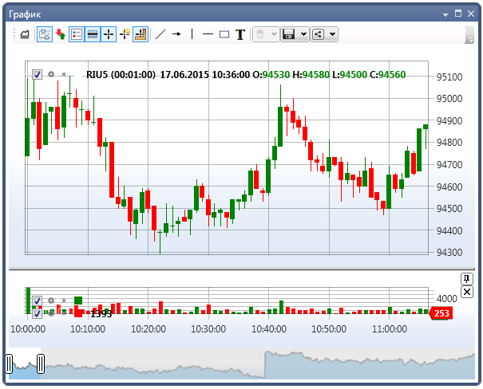
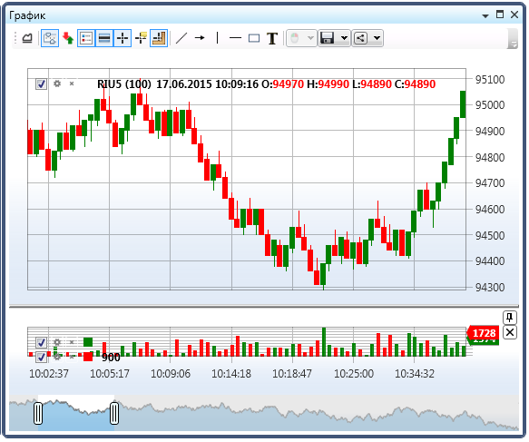

# Свечи

[S\#](StockSharpAbout.md) поддерживает следующие виды:

- [TimeFrameCandle](../api/StockSharp.Algo.Candles.TimeFrameCandle.html)

   \- свеча на основе временного отрезка, таймфрейма. Можно задавать как популярные отрезки (минутки, часовики, дневные), так и кастомизированные. Например, 21 секунда, 4.5 минуты и т.д. 
- [RangeCandle](../api/StockSharp.Algo.Candles.RangeCandle.html)

   \- свеча ценового разброса. Новая свеча создается, когда появляется сделка с ценой, выходящей за допустимые пределы. Допустимый предел формируется каждый раз на основе цены первой сделки. 
- [VolumeCandle](../api/StockSharp.Algo.Candles.VolumeCandle.html)

   \- свеча формируется до тех пор, пока суммарно по сделкам не будет превышен объем. Если новая сделка превышает допустимый объем, то она попадает уже в новую свечу. 
- [TickCandle](../api/StockSharp.Algo.Candles.TickCandle.html)

   \- то же самое, что и 

  [VolumeCandle](../api/StockSharp.Algo.Candles.VolumeCandle.html)

  , только в качестве ограничения вместо объема берется количество сделок. 
- [PnFCandle](../api/StockSharp.Algo.Candles.PnFCandle.html)

   \- свеча пункто\-цифрового графика (график крестики\-нолики). 
- [RenkoCandle](../api/StockSharp.Algo.Candles.RenkoCandle.html)

   \- Рэнко свеча. 

Как работать со свечами, показано в примере SampleConnection, который расположен в папке *Samples\/Common\/SampleConnection*.

На следующих рисунках представлены графики [TimeFrameCandle](../api/StockSharp.Algo.Candles.TimeFrameCandle.html) и [RangeCandle](../api/StockSharp.Algo.Candles.RangeCandle.html):





### Запуск получения данных

Запуск получения данных

1. Создадим серию свечей [CandleSeries](../api/StockSharp.Algo.Candles.CandleSeries.html): 

   ```cs
   ...
   \_candleSeries \= new CandleSeries(CandleSettingsEditor.Settings.CandleType, security, CandleSettingsEditor.Settings.Arg);
   ...		
   					
   ```
2. Все необходимые методы для получения свечей реализованы в классе [Connector](../api/StockSharp.Algo.Connector.html).

   Для получения свечей необходимо подписаться на событие [Connector.CandleSeriesProcessing](../api/StockSharp.Algo.Connector.CandleSeriesProcessing.html), сигнализирующее о появлении нового значения для обработки:

   ```cs
   \_connector.CandleSeriesProcessing +\= Connector\_CandleSeriesProcessing;
   ...
   private void Connector\_CandleSeriesProcessing(CandleSeries candleSeries, Candle candle)
   {
   	Chart.Draw(\_candleElement, candle);
   }
   ...
   					
   ```

   > [!TIP]
   > Для отображения свечей используется графический компонент [Chart](../api/StockSharp.Xaml.Charting.Chart.html). 
3. Далее передаём в коннектор созданную серию свечей и запускаем получение данных через [SubscribeCandles](../api/StockSharp.Algo.Connector.SubscribeCandles.html):

   ```cs
   ...
   \_connector.SubscribeCandles(\_candleSeries, DateTime.Today.Subtract(TimeSpan.FromDays(30)), DateTime.Now);	
   ...
   		
   					
   ```

   После этого этапа начнёт вызываться событие [Connector.CandleSeriesProcessing](../api/StockSharp.Algo.Connector.CandleSeriesProcessing.html).
4. Событии [Connector.CandleSeriesProcessing](../api/StockSharp.Algo.Connector.CandleSeriesProcessing.html) вызывается не только при появлении новой свечи, но и при изменении текущей.

   Если же нужно отображать только **"целые"** свечи, то необходимо проверить свойство [State](../api/StockSharp.Algo.Candles.Candle.State.html) пришедшей свечи:

   ```cs
   ...
   private void Connector\_CandleSeriesProcessing(CandleSeries candleSeries, Candle candle)
   {
       if (candle.State \=\= CandleStates.Finished) 
       {
          var chartData \= new ChartDrawData();
          chartData.Group(candle.OpenTime).Add(\_candleElement, candle);
          Chart.Draw(chartData);
       }
   }
   ...
   		
   ```
5. Для [CandleSeries](../api/StockSharp.Algo.Candles.CandleSeries.html) можно задать некоторые свойства:
   - [BuildCandlesMode](../api/StockSharp.Algo.Candles.CandleSeries.BuildCandlesMode.html) задает режим построения свечей. По умолчанию задан [LoadAndBuild](../api/StockSharp.Messages.MarketDataBuildModes.LoadAndBuild.html), что говорит о том, что будут запрошены готовые данные, или построены из заданного в свойстве [BuildCandlesFrom](../api/StockSharp.Algo.Candles.CandleSeries.BuildCandlesFrom.html) типа данных. Также можно установить [Load](../api/StockSharp.Messages.MarketDataBuildModes.Load.html) для запроса только готовых данных. Или [Build](../api/StockSharp.Messages.MarketDataBuildModes.Build.html), для построения из заданного в свойстве [BuildCandlesFrom](../api/StockSharp.Algo.Candles.CandleSeries.BuildCandlesFrom.html) типа данных без запроса готовых данных. 
   - При построении свечей необходимо задать свойство 

     [BuildCandlesFrom](../api/StockSharp.Algo.Candles.CandleSeries.BuildCandlesFrom.html)

     , которое говорит о том, какой именно тип данных используется как источник (

     [Level1](../api/StockSharp.Messages.MarketDataTypes.Level1.html)

     , 

     [MarketDepth](../api/StockSharp.Messages.MarketDataTypes.MarketDepth.html)

     , 

     [Trades](../api/StockSharp.Messages.MarketDataTypes.Trades.html)

      и тд. ). 
   - Для некоторых типов данных необходимо дополнительно указать свойство 

     [BuildCandlesField](../api/StockSharp.Algo.Candles.CandleSeries.BuildCandlesField.html)

     , из которого будут построены данные. Например, для 

     [Level1](../api/StockSharp.Messages.MarketDataTypes.Level1.html)

      можно указать 

     [BestAskPrice](../api/StockSharp.Messages.Level1Fields.BestAskPrice.html)

     , что говорт о том, что свечи будут строиться из свойства 

     [BestAskPrice](../api/StockSharp.Messages.Level1Fields.BestAskPrice.html)

      данных 

     [Level1](../api/StockSharp.Messages.MarketDataTypes.Level1.html)

     . 
6. Рассмотрим несколько примеров построения разных типов свечей:
   - Так как большинство источников предоставляют свечи стандартных таймфреймом, то для получения таких свечей достаточно задать тип и таймфрейм: 

     ```cs
     \_candleSeries \= new CandleSeries(typeof(TimeFrameCandle), security, TimeSpan.FromMinutes(5));
     					
     ```
   - Если необходимо просто загрузить готовые свечи, то необходимо задать свойство [BuildCandlesMode](../api/StockSharp.Algo.Candles.CandleSeries.BuildCandlesMode.html) в [Load](../api/StockSharp.Messages.MarketDataBuildModes.Load.html): 

     ```cs
     \_candleSeries \= new CandleSeries(typeof(TimeFrameCandle), security, TimeSpan.FromMinutes(5))
     {
     	BuildCandlesMode \= MarketDataBuildModes.Load,
     };	
     					
     ```
   - Если источник не предоставляет свечей необходимого таймфрейма, то их можно построить из других маркет данных. Ниже приведен приме построения свечей с таймфреймом 21 секунда из сделок: 

     ```cs
     \_candleSeries \= new CandleSeries(typeof(TimeFrameCandle), security, TimeSpan.FromSeconds(21))
     {
     	BuildCandlesMode \= MarketDataBuildModes.Build,
     	BuildCandlesFrom \= MarketDataTypes.Trades,
     };	
     					
     ```
   - Если источник данных не предоставляет ни свечей, ни сделок свечи можно построить из спреда стакана: 

     ```cs
     \_candleSeries \= new CandleSeries(typeof(TimeFrameCandle), security, TimeSpan.FromSeconds(21))
     {
     	BuildCandlesMode \= MarketDataBuildModes.Build,
     	BuildCandlesFrom \= MarketDataTypes.MarketDepth,
     	BuildCandlesField \= Level1Fields.SpreadMiddle,
     };	
     					
     ```
   - Так как не существует источников, предоставляющих готового **профиля объема**, его тоже необходимо строить из другого типа данных. Для прорисовки **профиля объема** необходимо установить свойство [IsCalcVolumeProfile](../api/StockSharp.Algo.Candles.CandleSeries.IsCalcVolumeProfile.html) в true, а также [BuildCandlesMode](../api/StockSharp.Algo.Candles.CandleSeries.BuildCandlesMode.html) в [Build](../api/StockSharp.Messages.MarketDataBuildModes.Build.html). И указать тип данных из которого будет построен **профиль объема**. В данном случае это [Trades](../api/StockSharp.Messages.MarketDataTypes.Trades.html): 

     ```cs
     \_candleSeries \= new CandleSeries(typeof(TimeFrameCandle), security, TimeSpan.FromMinutes(5))
     {
     	BuildCandlesMode \= MarketDataBuildModes.Build,
     	BuildCandlesFrom \= MarketDataTypes.Trades,
         IsCalcVolumeProfile \= true,
     };	
     					
     ```
   - Так как большинство источников данных не предоставляют готовые свечей, кроме [TimeFrameCandle](../api/StockSharp.Algo.Candles.TimeFrameCandle.html), то остальные типы свечей строятся аналогично **профилю объема**. Необходимо указать свойство [BuildCandlesMode](../api/StockSharp.Algo.Candles.CandleSeries.BuildCandlesMode.html) в [Build](../api/StockSharp.Messages.MarketDataBuildModes.Build.html) или [LoadAndBuild](../api/StockSharp.Messages.MarketDataBuildModes.LoadAndBuild.html). А также задать свойство [BuildCandlesFrom](../api/StockSharp.Algo.Candles.CandleSeries.BuildCandlesFrom.html) и свойство [BuildCandlesField](../api/StockSharp.Algo.Candles.CandleSeries.BuildCandlesField.html) если необходимо. 

     Следующий код демонстрирует построение [VolumeCandle](../api/StockSharp.Algo.Candles.VolumeCandle.html) с объемом в 1000 контрактов. В качестве источника данных для построения используется середина спреда стакана.

     ```cs
     \_candleSeries \= new CandleSeries(typeof(VolumeCandle), security, 1000m)
     {
     	BuildCandlesMode \= MarketDataBuildModes.LoadAndBuild,
     	BuildCandlesFrom \= MarketDataTypes.MarketDepth,
     	BuildCandlesField \= Level1Fields.SpreadMiddle,
     };
     					
     ```
   - Следующий код демонстрирует построение [TickCandle](../api/StockSharp.Algo.Candles.TickCandle.html) в 1000 сделок. В качестве источника данных для построения используются сделки.

     ```cs
     	   
     \_candleSeries \= new CandleSeries(typeof(TickCandle), security, 1000)
     {
     	BuildCandlesMode \= MarketDataBuildModes.Build,
     	BuildCandlesFrom \= MarketDataTypes.Trades,
     };
     					
     ```
   - Следующий код демонстрирует построение [RangeCandle](../api/StockSharp.Algo.Candles.RangeCandle.html) с диапазоном в 0.1 у.е. В качестве источника данных для построения используется лучшая покупка стакана:

     ```cs
     \_candleSeries \= new CandleSeries(typeof(RangeCandle), security, new Unit(0.1m))
     {
     	BuildCandlesMode \= MarketDataBuildModes.LoadAndBuild,
         BuildCandlesFrom \= MarketDataTypes.MarketDepth,
         BuildCandlesField \= Level1Fields.BestBid,
     };
     					
     ```
   - Следующий код демонстрирует построение [RenkoCandle](../api/StockSharp.Algo.Candles.RenkoCandle.html). В качестве источника данных для построения используется цена последней сделки из Level1:

     ```cs
     \_candleSeries \= new CandleSeries(typeof(RenkoCandle), security, new Unit(0.1m))
     {
     	BuildCandlesMode \= MarketDataBuildModes.LoadAndBuild,
         BuildCandlesFrom \= MarketDataTypes.Level1,
         BuildCandlesField \= Level1Fields.LastTradePrice,
     };
     					
     ```
   - Следующий код демонстрирует построение [PnFCandle](../api/StockSharp.Algo.Candles.PnFCandle.html). В качестве источника данных для построения используются сделки.

     ```cs
     \_candleSeries \= new CandleSeries(typeof(PnFCandle), security, new PnFArg() { BoxSize \= 0.1m, ReversalAmount \=1})
     {
     	BuildCandlesMode \= MarketDataBuildModes.Build,
     	BuildCandlesFrom \= MarketDataTypes.Trades,
     };	
     					
     ```

### Следующие шаги

[График](CandlesUI.md)

[Паттерны](CandlesPatterns.md)

[Собственный тип свечей](CandlesCandleFactory.md)
