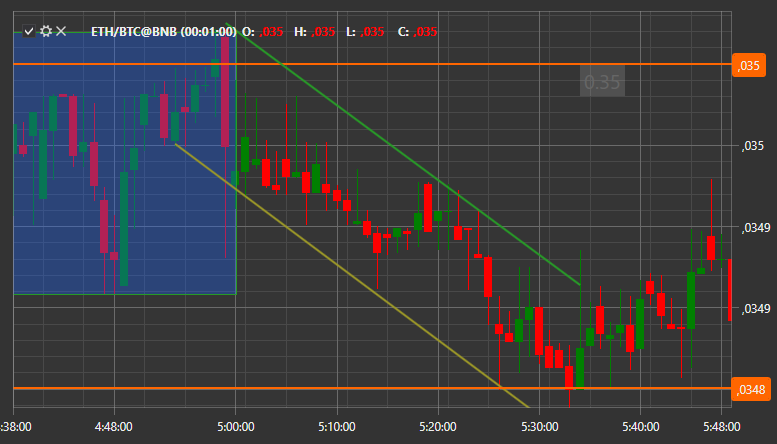

# Аннотации

[S\#](StockSharpAbout.md) предоставляет возможность добавлять аннотации на график в виде текста, линий и др. 



Добавление аннотаций не отличается от добавления любой другой информации на график. Сначала необходимо создать [ChartAnnotation](xref:StockSharp.Xaml.Charting.ChartAnnotation) и добавить его на область графика:

```cs
var _annotation = new ChartAnnotation { Type = ChartAnnotationTypes.BoxAnnotation };
Chart.AddElement(chartArea, _annotation);
		
```

После чего необходимо инициализировать новый экземпляр класса [AnnotationData](xref:StockSharp.Xaml.Charting.ChartDrawData.AnnotationData), в котором описать аннотацию и передать его в метод [Chart.Draw](xref:StockSharp.Xaml.Charting.Chart.Draw(StockSharp.Xaml.Charting.ChartDrawData))**(**[StockSharp.Xaml.Charting.ChartDrawData](xref:StockSharp.Xaml.Charting.ChartDrawData) data**)** для прорисовки на графике:

```cs
var data = new ChartDrawData.AnnotationData
{
    X1 = new DateTimeOffset(2017, 10, 02, 8, 30, 0, TimeSpan.FromHours(1)),
    X2 = new DateTimeOffset(2017, 10, 02, 10, 30, 0, TimeSpan.FromHours(1)),
    Y1 = 193.5m,
    Y2 = 194m,
    IsVisible = true,
    Stroke = new SolidColorBrush(Color.FromRgb(0, 0, 255)),
    Thickness = new Thickness(3),
    Text = "New annotation",
    HorizontalAlignment = HorizontalAlignment.Stretch,
    VerticalAlignment = VerticalAlignment.Stretch,
    LabelPlacement = LabelPlacement.Axis,
    ShowLabel = true,
    CoordinateMode = AnnotationCoordinateMode.Absolute,
};
var drawData = new ChartDrawData();
drawData.Add(_annotation, data);
Chart.Draw(drawData);
		
```
