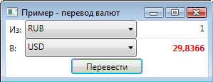

# Конвертация валют

Для работы с мультивалютными алгоритмами необходимо использовать [Currency](../api/StockSharp.Messages.Currency.html). [S\#](StockSharpAbout.md) предоставляет механизм перевода валют из одной в другую. В примере SampleCurrency, который находится в дистрибутиве, представлен калькулятор перевода любых валют.

### Пример конвертации валюты

Пример конвертации валюты

1. Ниже представлен кусок кода из SampleCurrency, который переводит из одной валюты в другую: 

   ```cs
   // создаем объект валюты Currency по введенным пользователям данным
   var currency = new Currency
   {
   	Type = (CurrencyTypes)this.SourceCurrencyType.GetSelectedValue<CurrencyTypes>(),
   	Value = this.Amount.Text.To<decimal>(),
   };
   // переводим в другую валюту и отображаем сконвертированное значение
   this.Result.Content = currency.Convert((CurrencyTypes)this.TargetCurrencyType.GetSelectedValue<CurrencyTypes>()).Value;
   ```
2. Если нужно узнать курс перевода, необходимо написать следующее: 

   ```cs
   // курс перевода Евро в Доллары США
   var rate = CurrencyTypes.EUR.Convert(CurrencyTypes.USD);
   ```
3. Дополнительно, [S\#](StockSharpAbout.md) предоставляет возможность узнать курс перевода в истории: 

   ```cs
   // курс перевода Евро в Доллары США на вчерашний день
   var rate = CurrencyTypes.EUR.Convert(CurrencyTypes.USD, DateTime.Today - TimeSpan.FromDays(1));
   ```
4. Пример конвертации валюты выглядит так: 

   

## См. также
