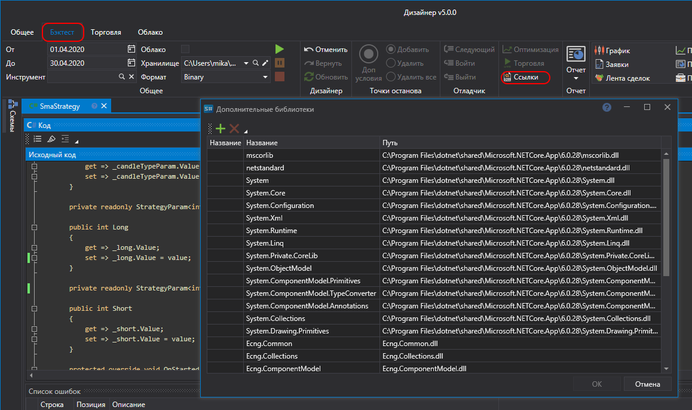

# Внешние DLL

При создании собственного кубика **Исходный код** на ряду с библиотеками [S\#.API](StockSharpAbout.md) можно использовать и другие библиотеки C\#, в том числе и собственные.

Нажав на кнопку **Ссылки** вкладки **Исходный код**, откроется окно **Дополнительные библиотеки**, в котором можно добавить или удалить Dll библиотеку.

## См. также
