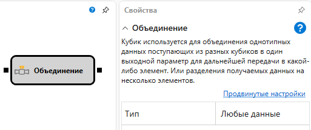

# Объединение

Кубик используется для объединения однотипных данных поступающих из разных кубиков в один выходной параметр для дальнейшей передачи в какой\-либо элемент. Или разделения получаемых данных на несколько элементов.

### Входящие сокеты

Входящие сокеты

- **Любые данные** – определяет тип получаемых и передаваемых данных.

### Исходящие сокеты

Исходящие сокеты

- **Любые данные** – определяет тип получаемых и передаваемых данных.

### Параметры

Параметры

- **Тип** – определяет тип получаемых и передаваемых данных.

## См. также

[Позиция](Designer_Position.md)
