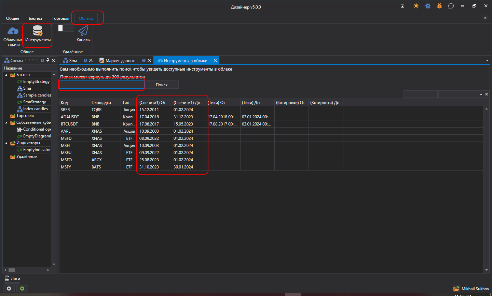
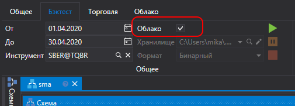
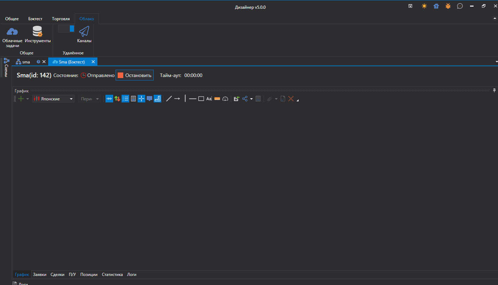
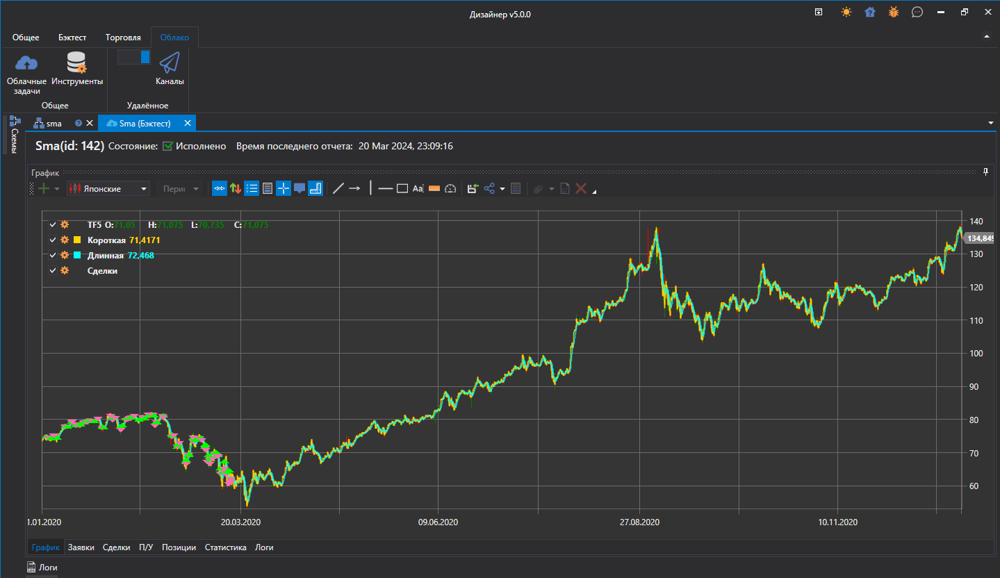
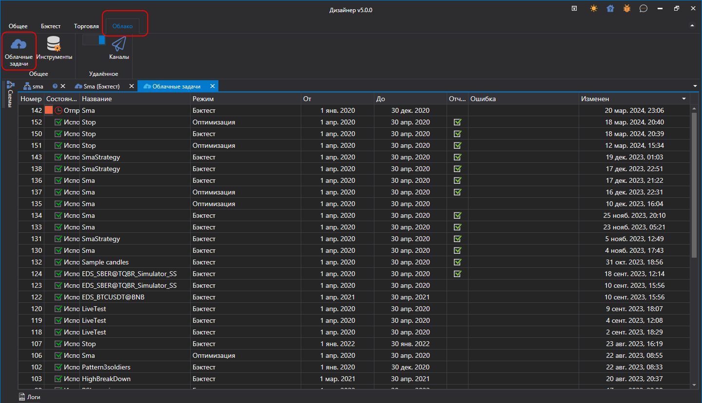

# Тестирование в облаке

Для тестирования стратегий в облаке необходимо предварительно найти все интересующие инструменты. Для этого в **Дизайнере** необходимо в закладке **Облако** открыть панель поиска инструментов, доступных для тестирования:

Введя в тестовое поле название инструмента и нажав на **Поиск** (или **Enter**), сервер StockSharp выдаст подходящие результаты поиска. Также будет указаны диапазоны дат исторических данных справа от названия инструментов.

Данную процедуру необходимо сделать только первый раз для каждого нового инструмента. После этого найденные инструменты будут сохранены локально на диск, и при перезапуске **Дизайнере** будут уже загружены из локального хранилища. Этот этап необходим так как при запуске стратегии требуется указание инструмента (а также при условии указания инструментов напрямую в кубике [Переменная](Designer_Variable.md)).

После этого необходимо вернуться к стратегии, и включить в закладке **Бэктест** опцию облако:

Нажав старт тестирования стратегия отправится в облако StockSharp вместо тестирования локально:

После окончания тестирования отчет с результатами будет показан в закладке ожидания задачи:

Если требуется посмотреть историю тестирования в облаке, а также увидеть текущие активные задачи, то в закладке **Облако** откройте панель **Задачи**:

