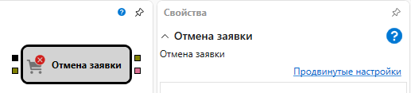

# Отмена заявки

Кубик используется для отмены заявки по инструменту.

### Входящие сокеты

Входящие сокеты

- **Заявка** – заявка, которую необходимо отменить.

### Исходящие сокеты

Исходящие сокеты

- **Заявка** – отмененная заявка, которая может использоваться для получения сделок по ней с помощью элемента **Сделки**, а также отображения на графике с помощью кубика **Панель графика**.

## См. также

[Регистрация заявки](Designer_Position_opening.md)
