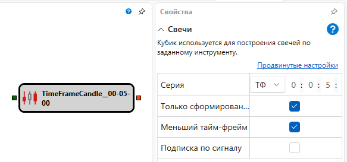

# Свечи

Кубик используется для построения свечей по заданному инструменту. 

### Входящие сокеты

Входящие сокеты

- **Инструмент** – инструмент, для которого необходимо строить свечи с заданными параметрами.

### Исходящие сокеты

Исходящие сокеты

- **Свечи** – построенные свечи.

### Параметры

Параметры

- **Серия** – тип серии свечей и параметры для указанного типа;
- **Только сформированные** – передавать на выход только полностью сформированные свечи или любое изменение;
- **Меньший таймфрейм** – строить свечи из меньшего тайм-фрейма;
- **Подписка по сигналу** – подписаться на данные только после прихода триггера.

## См. также

[Level 1](Designer_Level_1.md)
