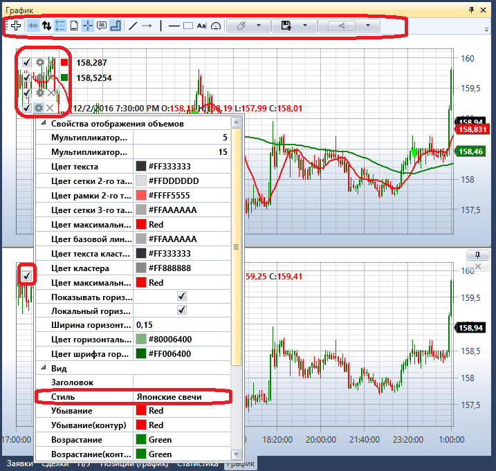
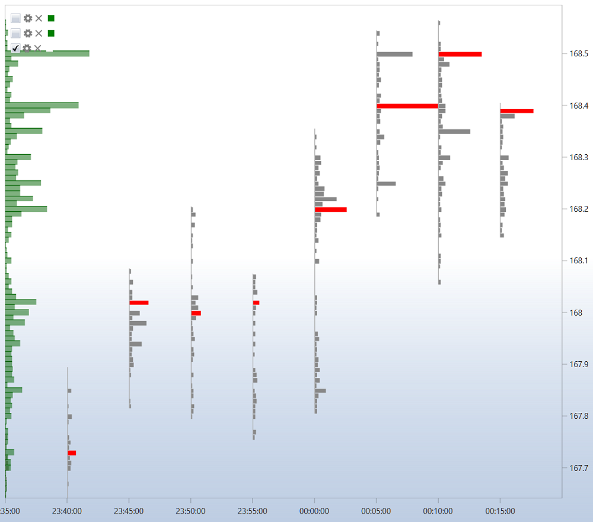
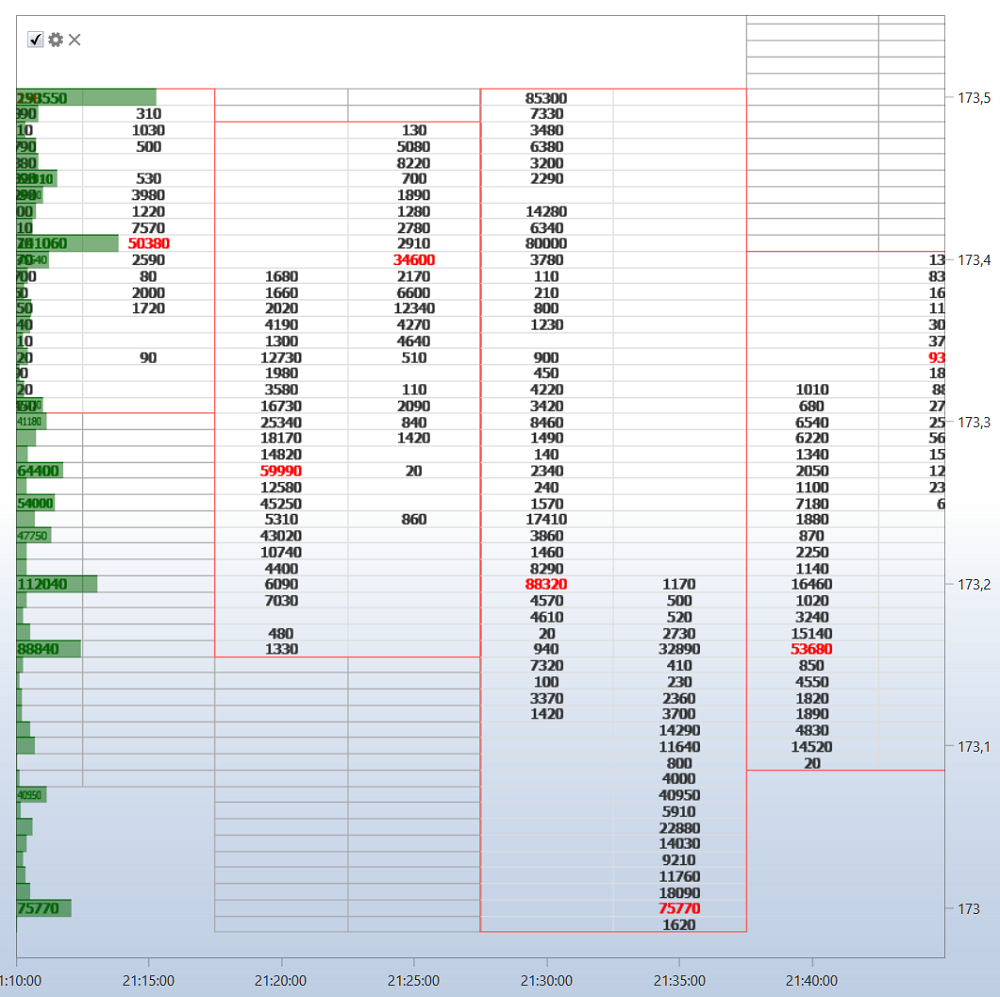
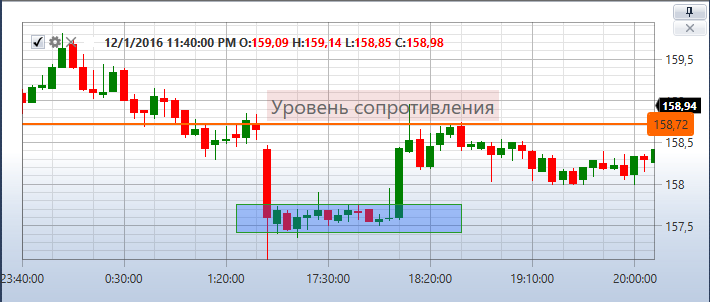

# График

Компонент **График** содержит в себе все кубики **Панель графика** что есть в стратегии. Например, если в стратегии используется два кубика **Панель графика**, то в компоненте **График** будут выведены 2 графика, как на рисунке.

В левом верхнем углу каждого графика показаны все графические элементы, добавленные на график. Если убрать флажок  на графическом элементе, уберется и элемент с графика. Нажав на кнопку , откроются настройки графического элемента. Также, настроить графический элемент можно в свойствах кубика [Панель графика](Designer_Panel_graphics.md).

В настройках графического элемента можно установить необходимый стиль графика: японские свечи, бары, боксовый график, кластерный профиль и др.

Для боксового графика свечи можно дополнительно группировать, порядок группировки устанавливается в полях: мультипликатор 2\-го таймфрейма, мультипликатор 3\-го таймфрейма.

Над графиком расположена лента инструментов, на которой можно выбрать режимы автопрокрутки, авто\-масштабирования, показа легенды и других общих настроек графика. Также можно выбрать элементы для рисования на графике: линии, уровни, указатели, прямоугольник, текст.

## См. также

[Заявки](Designer_Orders.md)
