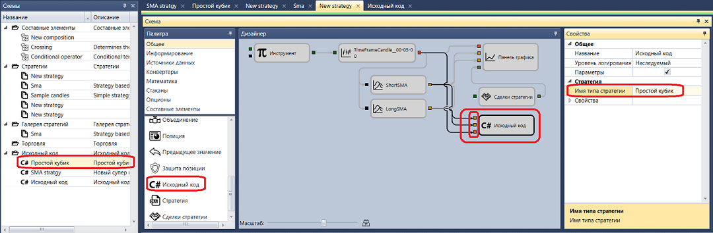

# Комбинирование C\# и стандартных кубиков

Пример написания кода стратегии SMA, приведенный в пункте [Пример стратегии на C\#](Designer_Creating_strategy_from_source_code.md), можно оптимизировать путем грамотного комбинирования кубиков [Исходный код](Designer_Source_code.md) и стандартных кубиков. Вынесем из кода все действия стратегии, которые проще создать из стандартных кубиков [Индикатор](Designer_Indicator.md), [Панель графика](Designer_Panel_graphics.md), [Сделки стратегии](Designer_Trades_strategy.md).

Так как Индикаторы SMA были вынесены в отдельные кубики, необходимо переписать метод ProcessCandle(Candle candle) так чтобы он принимал кроме свечей (Candle candle) еще и два индикатора ProcessCandle(DecimalIndicatorValue ssma, DecimalIndicatorValue lsma, Candle candle). И на базе этих значений рассчитывал стратегию. А также необходимо удалить все лишнее в коде. Окончательный вариант исходного кода кубика выглядит следующим образом:

```cs
using Ecng.Common;
using StockSharp.Messages;
using StockSharp.Algo;
using StockSharp.Algo.Candles;
using StockSharp.Algo.Strategies;
using StockSharp.Algo.Indicators;
using StockSharp.Xaml.Diagram.Elements;
public class NewStrategy : Strategy
{
    private bool \_isShortLessThenLong;
    \[DiagramExternal\]
    public void ProcessCandle(DecimalIndicatorValue ssma, DecimalIndicatorValue lsma, Candle candle)
    {
        \/\/ strategy are stopping
        if (ProcessState \=\= ProcessStates.Stopping)
        {
            CancelActiveOrders();
            return;
        }
        \/\/ calc new values for short and long
        var isShortLessThenLong \= ssma.Value \< lsma.Value;
        \/\/ crossing happened
        if (\_isShortLessThenLong \!\= isShortLessThenLong)
        {
            \/\/ if short less than long, the sale, otherwise buy
            var direction \= isShortLessThenLong ? Sides.Sell : Sides.Buy;
            \/\/ calc size for open position or revert
            var volume \= Position \=\= 0 ? Volume : Position.Abs().Min(Volume) \* 2;
            \/\/ calc order price as a close price + offset
            var price \= candle.ClosePrice + ((direction \=\= Sides.Buy ? Security.PriceStep : \-Security.PriceStep) ?? 1);
            RegisterOrder(this.CreateOrder(direction, price, volume));
            \/\/ store current values for short and long
            \_isShortLessThenLong \= isShortLessThenLong;
        }
    }
}
```

На общую схему необходимо вынести кубики [Переменная](Designer_Variable.md) с Типом **Инструмент**, [Свечи](Designer_Candles.md), 2 [Индикатор](Designer_Indicator.md) SMA, [Панель графика](Designer_Panel_graphics.md), [Сделки стратегии](Designer_Trades_strategy.md). Как это сделать подробно описано в пункте [Создание алгоритма из кубиков](Designer_Algorithm_creation_of_elements.md). Также на общую схему необходимо вынести кубик [Исходный код](Designer_Source_code.md), перенеся его в панель **Дизайнер** из панели **Палитра**. В свойствах кубика [Исходный код](Designer_Source_code.md) необходимо выбрать имя стратегии. Так как метод **ProcessCandle(DecimalIndicatorValue ssma, DecimalIndicatorValue lsma, Candle candle)** принимает три параметра, то и на входе кубика будет три параметра. Первые два параметра типа Значения индикатора, а третий типа Свеча. Соединив все кубики линиями, получается схема:



В результате код стратегии уменьшился с 213 строк до 43. Но добавилось всего 4 стандартных кубика. Если сравнивать с такой же стратегией, созданной из кубиков в пункте [Использование кубиков](Designer_Creating_strategy_out_of_blocks.md), то количество кубиков уменьшилось с 17 до 7. 

## См. также

[Создание DLL кубика в Visual Studio](Designer_Creating_DLL_element_in_Visual_Studio.md)
