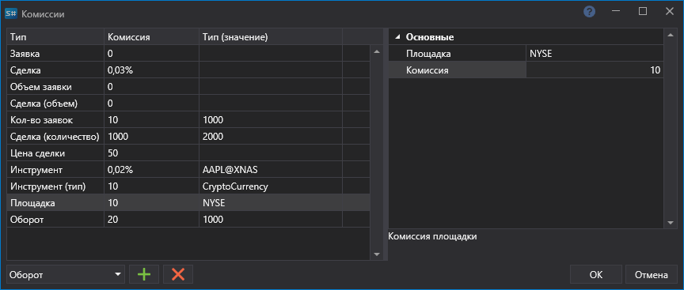

# Комиссии

На панели [Свойства тестирования](Designer_Properties_emulation.md) можно установить настройки контроля комиссии.

В окне **Комиссии** необходимо выбрать тип комиссии, настроить значение комиссии и условие, при котором комиссия будет начисляться.

### Список типов комиссий

Список типов комиссий

- **Заявки (количество)** \- Комиссия за количество заявок.
- **Заявка** \- Комиссия за заявку.
- **Заявка (объем)** \- Комиссия за объем в заявке.
- **Сделка (количество)** \- Комиссия за количество сделок.
- **Сделка (цена)** \- Комиссия за цену в сделке.
- **Сделка** \- Комиссия за сделку.
- **Сделка (объем)** \- Комиссия за объем в сделке.
- **Инструмент** \- Комиссия инструмента.
- **Инструмент (тип)** \- Комиссия типа инструмента.
- **Оборот** \- Комиссия за оборот .
- **Площадка** \- Комиссия площадки.
