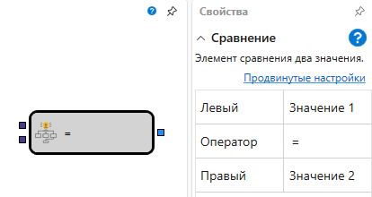

# Сравнение

Элемент используется для сравнения двух поступающих на вход объектов.

### Входящие сокеты

Входящие сокеты

- **Сравнение** – значения, которые допускают сравнение (например, числовое значение, строка, значение индикатора и т.д.).
- **Сравнение** – значения, которые допускают сравнение (например, числовое значение, строка, значение индикатора и т.д.).

### Исходящие сокеты

Исходящие сокеты

- **Флаг** – значение флага (характеризует состояние и имеет два значения: поднят (true) и опущен (false)).

### Параметры

Параметры

- **Левый** – параметр, значение которого будет использоваться в левой части сравнения.
- **Оператор** – условие, с помощью которого необходимо сравнить переданные значения.
- **Правый** – параметр, значение которого будет использоваться в правой части сравнения.

При смене оператора название кубика автоматически меняется на название оператора.

## См. также

[Индикатор](Designer_Indicator.md)
