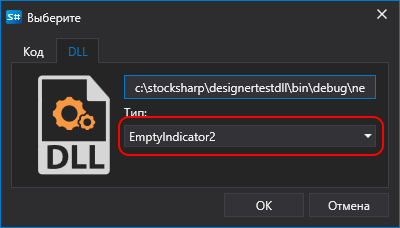

# Создание кубика и индикатора

Алгоритм создания кубика или индикатор из DLL сборки аналогичен процессу из кода (см создание [кубика](Designer_Combine_Source_code_and_standard_elements.md) и [индикатора](Designer_Creating_indicator_from_source_code.md)) за исключением этапа выбора контента. Аналогично при добалении [стратегии из DLL](Designer_Creating_strategy_from_dll.md) можно выбрать и тип кубика и тип индикаторы, если они созданы в подключаемой DLL:

В случае создания индикатора, для компилирования кода необходимо подключить NuGet пакет [StockSharp.Algo](https://www.nuget.org/packages/stocksharp.algo), где находится базовый класс для всех индикаторов [Strategy](xref:StockSharp.Algo.Indicators.BaseIndicator).

В случае создания кубика, для компилирования кода необходимо подключить NuGet пакет [StockSharp.Diagram.Core](https://www.nuget.org/packages/stockSharp.diagram.core), где находится базовый класс для всех кубиков [DiagramExternalElement](xref:StockSharp.Diagram.DiagramExternalElement).

При добавлении подключенных кубиков или индикаторов на схему необходимо выполнить шаги, описанные в разделах [кубика](Designer_Combine_Source_code_and_standard_elements.md) или [индикатора](Designer_Creating_indicator_from_source_code.md).

## См. также

[Отладка DLL кубика с помощью Visual Studio](Designer_Debugging_DLL_using_Visual_Studio.md)
