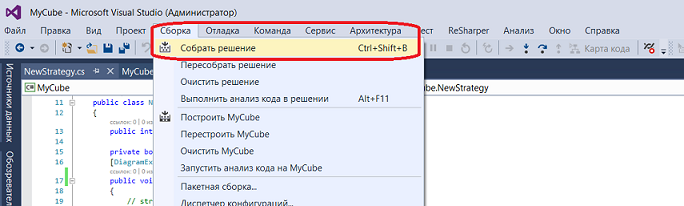

# Создание DLL кубика в Visual Studio

Для написания кода в Visual Studio необходимо создать проект в Visual Studio:

В созданный проект необходимо установить [S\#.API](StockSharpAbout.md). Существуют два способа установки [S\#.API](StockSharpAbout.md): Установка из репозитория GitHub\/StockSharp с веб\-сервиса GitHub [StockSharp Releases](https://github.com/StockSharp/StockSharp/releases/) и установка из Visual Studio при помощи сервиса Nuget. Об установке [S\#.API](StockSharpAbout.md) описано в пункте [Установка S\#.API](StockSharpInstall.md). 

В дальнейшем процесс создания стратегии не отличается от описанного в пункте [Пример стратегии на C\#](Designer_Creating_strategy_from_source_code.md). После создания стратегии необходимо собрать проект, нажав **Собрать решение** во вкладке **Сборка**.

В Visual Studio по умолчанию проект собирается в папку …\\bin\\Debug\\ .

Для добавления Dll в общую схему необходимо вынести кубик [DLL стратегия](Designer_DLL_Strategy.md), в панели свойства указать в поле **Сборка** Dll сборку. После чего появится возможность выбрать кубик по имени в поле **Имя типа стратегии**:

## См. также

[Отладка DLL кубика с помощью Visual Studio](Designer_Debugging_DLL_using_Visual_Studio.md)
