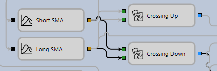
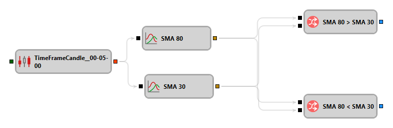
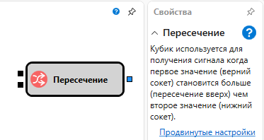

# Создание составных элементов

При составлении схем часто возникают наборы элементов, которые представляют собой законченный функционал и могут быть использованы в различных схемах или одной схеме множество раз с различными значениями свойств. Подобные наборы элементов можно вынести в отдельный составной элемент, который дальше будет использоваться как любой обычный кубик.

Составной элемент представляет собой обычную схему, которая сохраняется\/загружается\/редактируется как любая схема стратегии.

При добавлении составного элемента на схему, для него автоматически добавляются все неподключенные параметры всех внутренних кубиков. Неподключенные параметры на входе кубиков добавляются как входные, неподключенные параметры на выходе как выходные. Каждый добавленный параметр именуется названием исходного элемента и названием его параметра. Дополнительно для этого элемента добавляются свойства всех элементов, для которых было указано свойство **Параметры**.

Использование составных элементов рассмотрим на примере стратегии пересечения скользящих средних SMA, в которой наглядно показано использование составного элемента [Пересечение](Designer_Crossing.md) несколько раз. Стратегия может открывать как длинную позицию при пересечении короткой скользящей средней длинную снизу\-вверх, так и короткую позицию при пересечении короткой скользящей средней длинную сверху\-вниз. Схема части стратегии пересечения скользящих средних, где определяется момент пересечения скользящих средних, показан на рисунке ниже:

Т.к. пересечение скользящих средних отличаются только возможным направлением пересечения (короткая пересекает сверху\-вниз или снизу\-вверх), то часть схемы, которая определяет момент пересечения, может быть вынесена в отдельный составной элемент. При добавлении на схему стратегии будут указаны свойства для определения алгоритма пересечения скользящих средних. Схема составного элемента, с помощью которого определяется пересечение, показана на рисунке ниже:

Схема составного элемента состоит из элементов простого типа и основана на запоминании текущего значений (Prev In 1 и Prev In 2) и сравнении пар, текущих (CurrComparison) и предыдущих (PrevComparison) значений между собой. Т.к. каждое из входных значений используется в двух элементах схемы, на входе составного элемента поставлены элементы [Объединение](Designer_Association.md) (In 1, In 2), которые позволяют один вход разделить на два элемента и передать входное значение в элементы [Сравнение](Designer_Comparison.md) и [Предыдущее значение](Designer_Previous_value.md). При поступлении нового значения на входе выполняется сравнение текущих значений и передача нового значения в элемент [Предыдущее значение](Designer_Previous_value.md), откуда на выходе передается предыдущее значение для текущего входа, после чего выполняется сравнение предыдущих значений. Если оба условия выполняются, что проверяется с помощью элемента [Логическое условие](Designer_Logical_condition.md) (And), то на выход составного элемента передается значение поднятого флага, которое может использоваться как триггер для выполнения дальнейших действий.

Для кубиков CurrComparison и PrevComparison установлен флаг **Параметры** группы свойств **Общее**. Поэтому свойства этих кубиков были вынесены в свойства составного элемента [Пересечение](Designer_Crossing.md), которые далее будут указаны при использовании составного элемента в схеме стратегии.

## См. также

[Вывод свечей на график](Designer_Conclusion_of_candles_on_chart.md)
