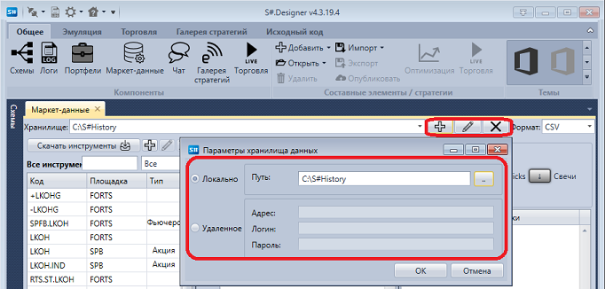
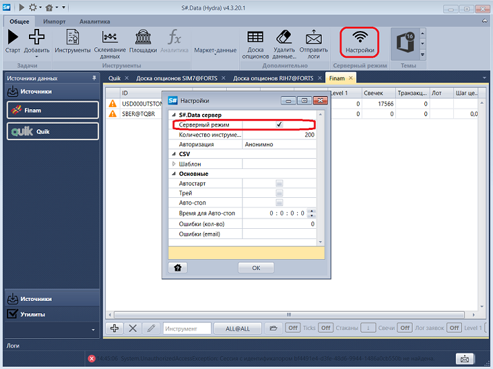
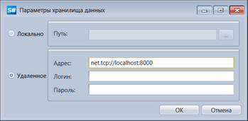
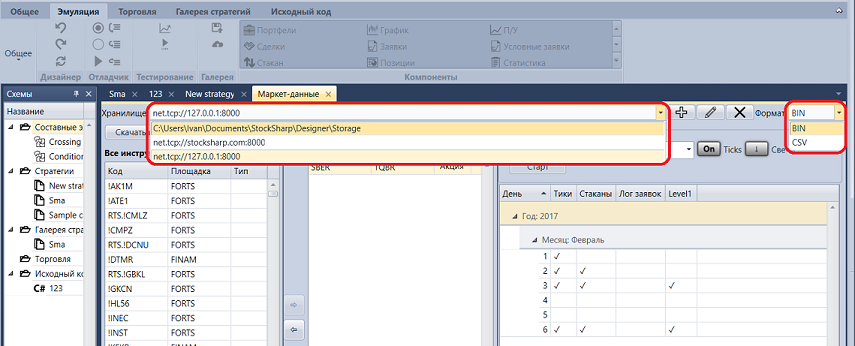

# Создание хранилища исторических данных

Создать хранилище исторических данных можно, нажав на кнопку  вкладки **Маркет\-данные**. Нажав на кнопку  , можно изменить параметры текущего хранилища . Нажав на кнопку  , можно удалить из списка хранилищ текущее хранилище.

Хранилище исторических данных может быть локальное или удаленное.

Локальное хранилище \- это когда все данные хранятся на локальном компьютере. Для задания локального хранилища достаточно задать путь до папки где хранятся данные.

Удаленное хранилище может быть расположено на удаленном компьютере. Для задания удаленного хранилища необходимо задать адрес удаленного хранилища, логин и пароль при необходимости. 

Воспроизвести удаленное хранилище на локальной машине можно с помощью программы [S\#.Data](Hydra.md) (кодовое название Hydra), предназначенной для автоматической загрузки маркет\-данных (инструменты, свечи, тиковые сделки и стаканы и др.) из различных источников, и хранения их в локальном хранилище. Для этого [S\#.Data](Hydra.md) необходимо перевести в серверный режим, данный функционал доступен в расширенной лицензии ([Лицензирование StockSharp](License.md)).

После чего в [S\#.Designer](Designer.md), нажав на кнопку  , добавить новое хранилище. В настройках хранилища в поле адрес указываем «net.tcp:\/\/localhost:8000». Нажать ОК. При использовании [S\#.Data](Hydra.md) в качестве удаленного хранилища не стоит забывать, что [S\#.Data](Hydra.md) должна быть запущена и настроена соответствующим образом.

После добавления нового хранилища, его можно выбрать в выпадающем списке **Хранилище**.

Также необходимо выбрать формат файлов хранилища BIN или CSV. Данные могут сохраняться в двух форматах: в специальном бинарном формате BIN, что обеспечивает максимальную степень сжатия, или в текстовом формате CSV, что удобно при анализе данных в других программах. BIN формат предпочтителен, когда есть необходимость экономить место на диске. CSV формат предпочтителен, когда есть необходимость корректировать данные вручную. CSV легко редактируется стандартным блокнотом, MS Excel и др..

## См. также

[Скачивание инструментов](Designer_Download_instruments.md)
