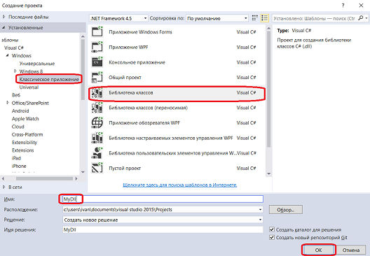
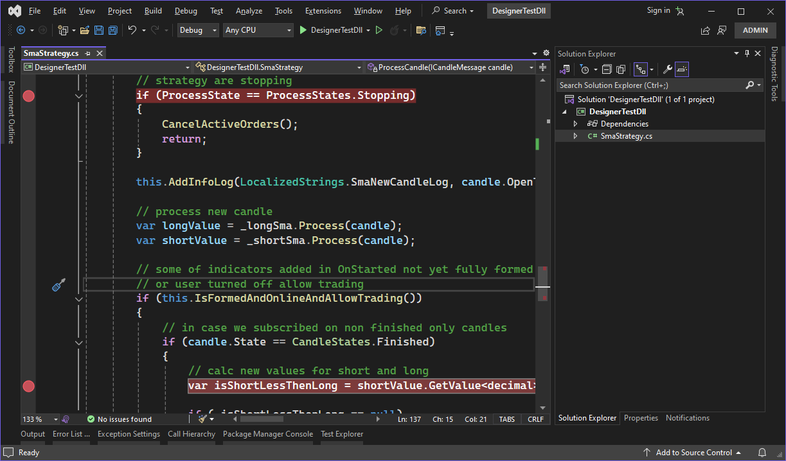
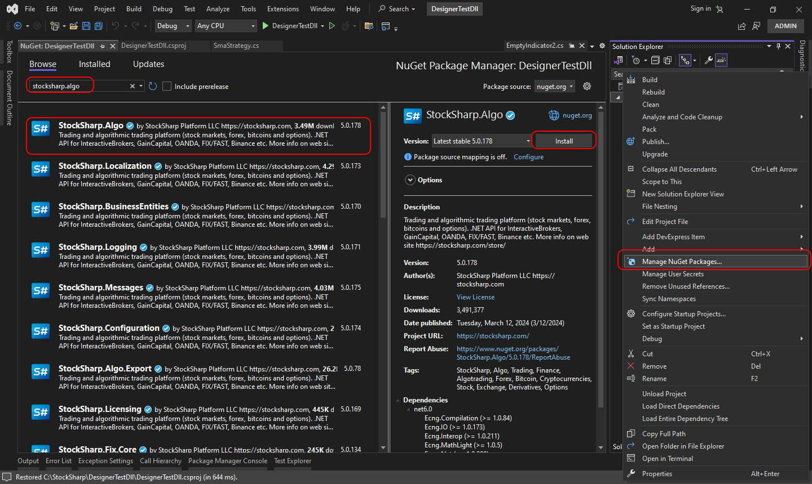
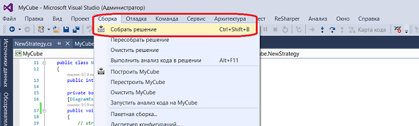
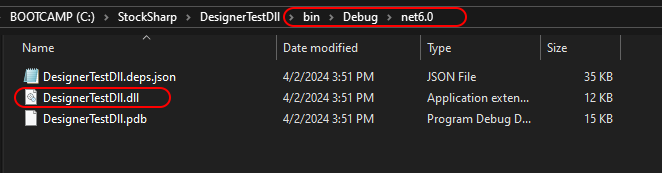
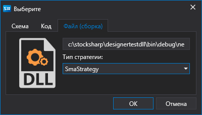
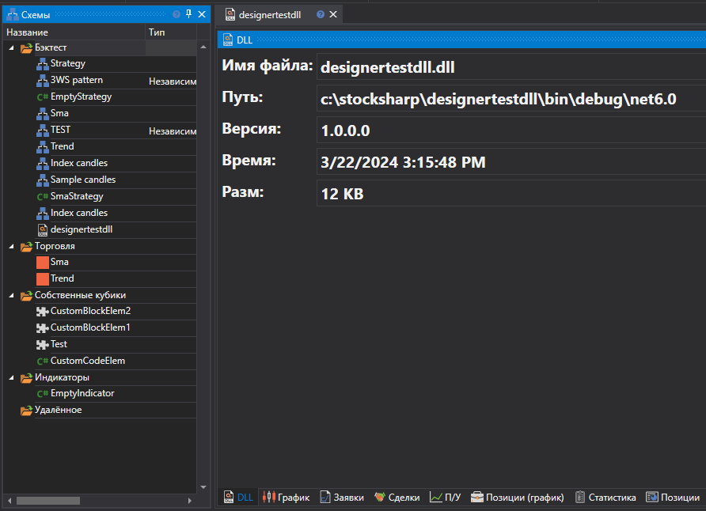
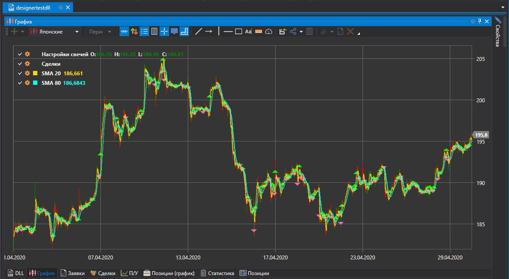

# Использование DLL

Использование готовых DLL привычно для тех, кто хочет постоянно работать в средах **Visual Studio** и **JetBrains Rider**. Такой подход дает несколько преимуществ перед написание [кода](Designer_Creating_strategy_from_code.md) внутри **Дизайнера**:

- Расширенный редактор кода по сравнению со встроенным редактором внутри **Дизайнер**.
- Перекомпилирование кода автоматически обновляет контент внутри **Дизайнера**.
- Возможно разбить код на несколько файлов (в случае подхода [кода](Designer_Creating_strategy_from_code.md) возможен только вариант ОдинФайл-ОднаСтратегия).
- Использование [отладчика](Designer_Debugging_DLL_using_Visual_Studio.md).

### Создание проекта в Visual Studio

1. Чтобы создать стратегию в **Visual Studio** необходимо необходимо создать проект:

2. Далее необходимо написать код стратегии. Для быстрого старта можно скопировать код SmaStrategy, которая создается как шаблон в [стратегии из кода](Designer_Creating_strategy_from_source_code.md):

3. Для компилирования кода необходимо подключить NuGet пакет [StockSharp.Algo](https://www.nuget.org/packages/stocksharp.algo), где находится базовый класс для всех стратегий [Strategy](xref:StockSharp.Algo.Strategies.Strategy):

4. После создания стратегии необходимо собрать проект, нажав **Собрать решение** во вкладке **Сборка**.

5. В Visual Studio по умолчанию проект собирается в папку …\\bin\\Debug\\net6.0 .

### Добавление DLL в Дизайнер

1. Добавление стратегии из DLL происходит аналогично созданию стратегии из [кода](Designer_Creating_strategy_from_code.md). Но на этапе определения типа контента необходимо выбрать **DLL**:

2. В окне необходимо указать путь к сборке (должна быть совместима с .NET 6.0), и выбрать тип. Последнее необходимо, так как в одной DLL может быть сразу несколько стратегий (или [кубиков с индикаторами](Designer_Creating_DLL_element_in_Visual_Studio.md)). После нажатия на **OK** стратегия будет добавлена на панель **Схемы** и готова к работе:

3. Запуск стратегии на [бэктест](Designer_Backtesting_Interface.md), на [live](Designer_Add_strategy_Live_trade.md) и другие операции - аналогично работе стратегии из схемы и кода:

