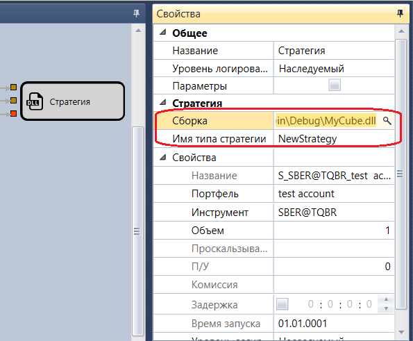

# DLL стратегия

Кубик используется для импорта Dll библиотек со стратегиями([Создание DLL кубика в Visual Studio](Designer_Creating_DLL_element_in_Visual_Studio.md)).

#### Параметры

Параметры

- **Сборка** – Dll библиотека, содержащая стратегию, которую необходимо добавить.
- **Имя типа стратегии** – имя типа стратегии, которую необходимо добавить.

## См. также

[Сделки стратегии](Designer_Trades_strategy.md)
