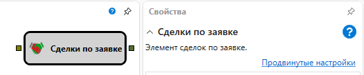

# Сделки по заявке

Кубик используется для получения сделок по конкретной заявке.

#### Входящие сокеты

Входящие сокеты

- **Заявка** – заявка, по которой нужно получить сделки. Может быть получена из элемента **Открытие позиции**.

#### Исходящие сокеты

Исходящие сокеты

- **Сделки** – сделки, возникающие по переданной заявке. Могут использоваться как для отображения на графике с помощью элемента **Панель графика**, так и для защиты позиции с помощью элемента **Защита позиции**.

## См. также

[Объединение](Designer_Association.md)
