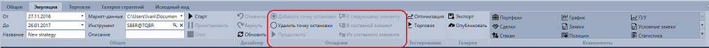

# Отладка

В процессе тестирования стратегий часто возникает необходимость проверить, какие данные поступают на вход того или иного кубика или передаются на его выходе. Для этого в [Designer](Designer.md) существует **Отладчик**.

На вкладке **Эмуляция** ленты в группе **Отладчик** расположены кнопки:

- **Добавить точку остановки** – при выделенном элементе добавить точку останова. Элементы, для которых добавлена точка останова, выделяются красной рамкой.
- **Убрать точку остановки** – удалить точку останова.
- **К следующему элементу** – при сработавшей точке останова выполняет переход к следующему элементу схемы.
- **Step to out** – при сработавшей точке останова выполняет переход к выходу текущего элемента, используется для проверки значений, которые передаются на выходе элемента.
- **В составной элемент** – при сработавшей точке останова выполняет переход внутрь составного элемента. При этом автоматически открывается схема составного элемента и выполняется остановка на элементе, в который первым передаются данные.
- **Из составного элемента** – при сработавшей точке останова и нахождении внутри составного элемента, выполняет выход на уровень вверх, где используется открытый составной элемент.
- **Продолжить** – продолжает выполнение до срабатывания следующей точки останова.

## См. также

[Точки остановки](Designer_Debug_Break_Points.md)
