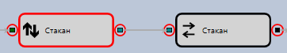
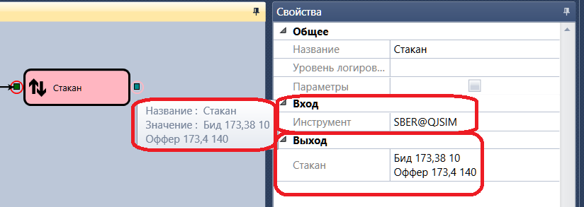
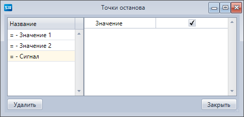

# Точки остановки

Чтобы добавить точку остановки, необходимо выделить кубик и нажать на кнопку **Добавить точку остановки**. Места остановки выделятся красным кружком:

В момент срабатывания точки останова на элементе, фон элемента меняется на светло\-красный, элемент автоматически выделяется в окне свойств, показываются его свойства и значения входных и выходных параметров. Если мышкой навести на входной или выходной параметр, то появится подсказка со значением параметра. Пример просмотра значений на входе и выходе составного элемента в процессе выполнения стратегии приведен на рисунке ниже:

Точки останова могут быть добавлены как до запуска процесса тестирования, так и в процессе тестирования стратегии на истории.

Если нажать на кнопку **Точки останова**, появится окно, в котором будут отображены все точки останова. Для каждой из них можно задать дополнительное условие срабатывания. Например, для логического сигнала можно установить значение **Истина**. В таком случае, точка останова будет останавливаться только если значение сигнала будет **Истина**. 

## См. также

[Пошаговое исполнение](Designer_Step.md)
