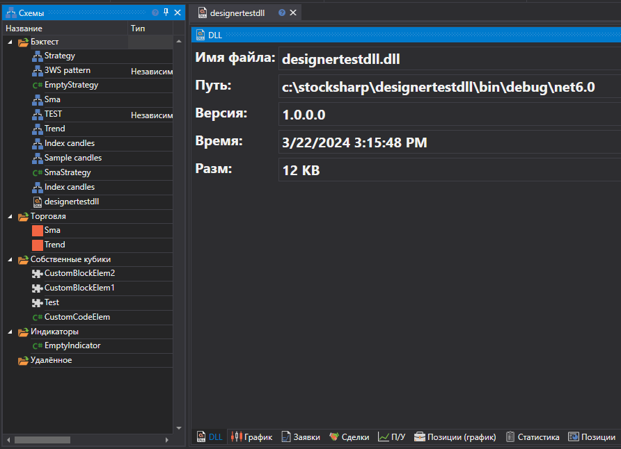
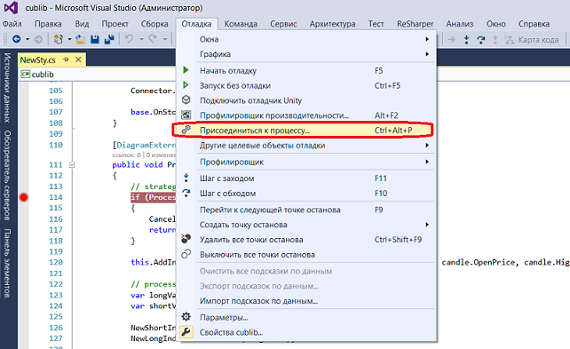
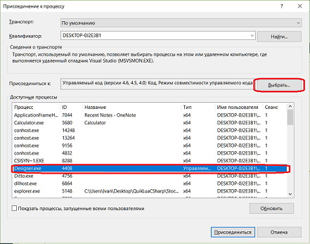
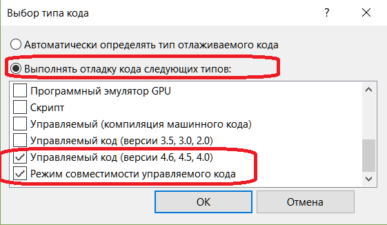
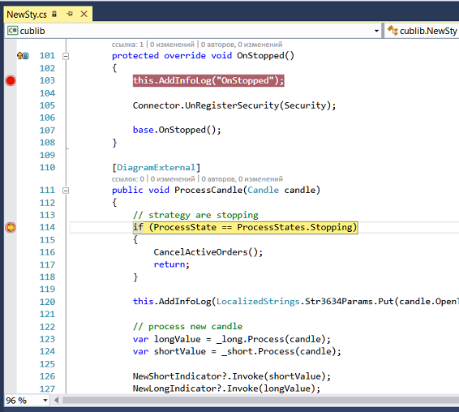

# Отладка DLL с помощью Visual Studio

В Visual Studio существует механизм присоединения к выполняемым процессам с использованием отладчика Visual Studio. Наиболее подробно об отладчике Visual Studio написано в документации [Присоединиться к процессам](https://learn.microsoft.com/ru-ru/visualstudio/debugger/attach-to-running-processes-with-the-visual-studio-debugger?view=vs-2022). Далее отладка будет рассмотрена на примере стратегии, добавленной в пункте [Использование DLL](Designer_Creating_strategy_from_dll.md).

1. Для того чтобы присоединить к процессу и начать отладку DLL стратегии необходимо, чтобы она была загружен в память. Загрузка DLL в память происходит после [добавления стратегии](Designer_Creating_strategy_from_dll.md). После загрузки DLL в память можно будет присоединить к процессу.

2. В Visual Studio выбрать пункт **Отладка \-\> Присоединить к процессу**.

3. В диалоговом окне **Присоединение к процессу** найти в списке **Доступные процессы** процесс **Designer.exe**, к которому требуется присоединиться.

Если процесс выполняется с другой учетной записи пользователя, необходимо установить флажок **Показать процессы всех пользователей**.

4. Важно, чтобы в окне **Присоединиться** был указан тип кода, который необходимо отладить. Параметр по умолчанию **Авто** пытается определить тип кода, который нужно отладить, но не всегда правильно определяет тип кода. Чтобы вручную задать тип кода, необходимо выполнить следующие действия.

- В поле Присоединиться кликнуть **Выбрать**.
- В диалоговом окне **Выбор типа кода** нажать кнопку **Выполнять** отладку кода следующих типов и выберите типы для отладки.
- Нажать кнопку ОК.

5. Нажать кнопку Присоединить.

6. В Visual Studio в коде необходимо расставить точки останова. Если точки останова красные и заполненные красным  (и Студия в режиме отладки) то значит загрузилась именно та версия dll. А если точки останова красные и заполненные белым  (и Студия в режиме отладки), то значит загрузилась не та версия dll. 

7. В примере точка останова стоит в первой строчке метода **public void ProcessCandle(Candle candle)**. При запуске стратегии в [Designer](Designer.md), как только в DLL начнут передаваться значения свечей, в Visual Studio произойдет остановка в месте установки точки останова. Далее можно будет отследить ход выполнения кода:

> [!WARNING] 
> При остановке кода в отладчике происходит приостановка исполнения всех процессов внутри программы **Designer**. Если программа подключения к реальным торгам, то в случае длительной остановки под отладчиком будут происходить разрывы подключений.

## См. также

[Экспорт стратегий](Designer_Export_strategies.md)
