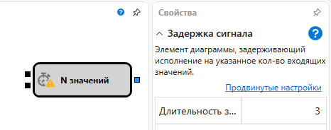
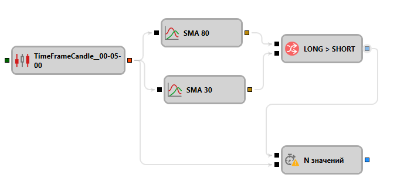

# Задержка значения

Кубик используется для задержки значения на N итераций.

#### Входящие сокеты

Входящие сокеты

- **Триггер** – инициализация внутреннего счетчика для отсчета задержки.
- **Вход** - любое входящее значение, которое уменьшает внутренний счетчик. При достижении счетчика нуля он деактивируется, и вызывается исходящий сокет. Если счетчик не был инициализирован **Триггером**, то входящие значения игнорируются.

### Исходящие сокеты

Исходящие сокеты

- **Сигнал** – флаг, оповествляющий что счетчик был достигнут нуля.

### Параметры

Параметры

- **Длительность** - длительность задержки.

## См. также

[Сравнение](Designer_Comparison.md)
