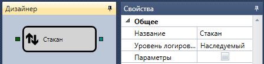

# Стакан

Кубик используется для получения стакана по заданному инструменту.

### Входящие сокеты

Входящие сокеты

- **Инструмент** – инструмент, для которого надо получить стакан.

### Исходящие сокеты

Исходящие сокеты

- **Стакан** – изменения стакана с момента подписки на получение данных (поступления инструмента на вход элемента).

## См. также

[Сгруппированный стакан](Designer_Depth_Grouped.md)
