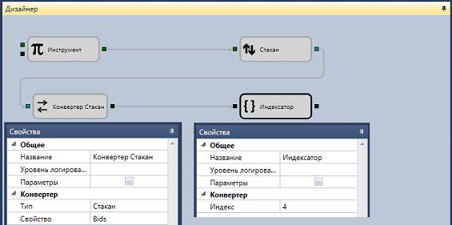

# Получение указанного уровня в стакане

Для получения необходимой строки покупок из стакана может использоваться следующая схема:

Для кубика [Переменная](Designer_Variable.md) выбран тип данных **Инструмент**. Если инструмент не указан, но установлен флаг **Параметры** группы свойств **Общее**, то он будет взят из стратегии. Для кубика [Конвертер](Designer_Converter.md) выбран тип данных и соответствующее поле коллекции кубиков на покупку Bids. Кубик индексатор получает необходимый элемент из коллекции лучших цен на покупку. Для получения конкретного значения цены или объема на уровне может использоваться кубик [Конвертер](Designer_Converter.md).

## См. также

[Галерея](Designer_Gallery_of_strategies.md)
